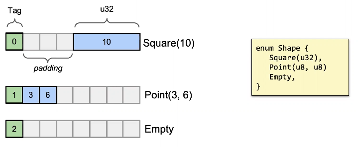

# Lezione del 22/03

Rust non è propriamente un linguaggio di programmazione ad oggetti, ma sarebbe più corretto definirlo un linguaggio per tipi.
Nonostante ciò, possiamo definire strutture dati che per tanti aspetti sono funzionalmente indistinguibili da quello che normalmente ci aspetteremmo in un linguaggio ad oggetti.
 
In Rust la dichiarazione di una struttura viene divisa in due parti.
La prima, quella con la dichiarazione dei dati, la seconda è la sua implementazione dove troviamo i metodi ad essa associata.
Per queste due azioni, si utilizzano rispettivamente le parole chiavi `impl` e `struct`.
È anche presente una parola chiave `self` che prende il ruolo di analogo alla più comune `this`.
Quind un codice come questo in C++:

```C++
class Something {
    int i; // Dati
    String s;
    void proces() {...} // Metodi
    int increment() {...}
}
```

In Rust avrebbe queste sembianze:

```rust
struct Something {
    i : i32,    // Dati
    s : String
}

...

impl Something {
    fn process(&self) {...} // Metodi 
    fn increent(&mut self) {...}
}
```

Notiamo cone in Rust ogni "metodo" accetti come primo parametro una qualche referenza a `self`, di cui parleremo meglio nel dettaglio, e che a differenza di altri linguaggi, in metodo non dichiarato esplicitamente come pubblico (`pub`) è di base privato.

La chiamata a funzione è concessa come `istanza.funzione` oppure `struct.funzione(istanza)`

```rust
impl str {
    pub const fn len(&self) -> usize {...}
}
...
let str1 : &str = "abc";
println!("{}", str1.len());
println!("{}", str::len(str1));
```

`self` puo' essere gestito in vari modi, che corrispondono a diversi modi di intendere chi possieda `self` infatti.
Infatti indicando `self` come parametro, non esistendo di base il concetto di copia in Rust, quel che staremmo attuando è un movimento, vale a dire che nel moemnto in cui richiamo la funzione su un dato, il vecchio dato risulterà mosso e quindi non più utilizzabile

Ovviamente se questo fosse l'unico modo di utilizzare le funzioni, sarebbe pittosto sconveniente, e infatti è possibile passare una referenza in sola lettura alle funzioni, che quindi non consentono la modifica dei dati all'interno della struttura, ed una che invece cede momentaneamente il possesso della variabile per eseguirne la modifica, rispettivamente `&self` ed `&mut self`.

In Rust a differenza di altri linugaggi non esiste propriamente il concetto di costruttore o distruttore.
Questo non significa che le nostre strutture ci compaiano tra le mani per magia, ma che tocchi quindi a noi implementare i metodi per ottenere le istanze delle strutture.

Tuttavia, per rimanere più vicini al concetto di programmazione ad oggetti, per convenzione la funzione che inizializza i campi di una struttura è comunque chiamata `new`, mentre il tratto `Drop` permette di eseguire alcune operazioni preliminarei prima che il SO liberi le risorse da esse occupate.

Qui vediamo un primo esempio di come implementare un tratto per una funzione, che funzionalmente potremmo inquadrare in quelle che sono le interfacce in Java.

```rust
pub struct Shape {
    ...
}

impl Drop for Shape {
    fn drop(&mut self) {
        println!("Dropping shape");
    }
}
```

Parleremo dopo della differenza tra `Copy` e `Clone`, ma questa è una occasione per notare che in Rust alcuni tratti possono essere mutualmente esclusivi, ovvero che una struttura che implementi un tratto `A` non possa implementare un tratto `B`
In questo caso ad esempio, un struttura che implementa il tratto `Drop` non puo' implementare il tratto `Copy`.

È consentito l'utilizzo di metodi statici, ovvero metodi che non appartengono ad una istanza della struttura ma alla struttura in sè.

Questo è concesso tramite la parola chiave `static`, e non richiedono ovviamente il parametro `self` come primo argomento.
Questo è anche il modo in cui si possono implementare alcuni pattern molto noti, come il `Singleton`.

Passiamo ora a parlare di una funzionalità che in Rust è stata molto arricchita rispetto al C, gli enumeratori.
Qui non solo possiamo definire un'etichetta senza per forza definirne il valore o definirle fuori seqeuenza.

```rust
enum HTTPResponse {
    OK = 200,
    NOTFOUND = 404,
    INTERNALERROR = 500
}
```

Una differnza sostanziale rispetto ad altri linugaggi è che possiamo anche definirli anche come un tipo di somma o come un dato specifico, ovvero un `enum` in rust puo' contenere l'unione dei valori di dato delle singole etichette.
Tuttavia facendo ciò bisogna tener conto che si applicano dei crietri esattamente opposti a quelli degli `enum`.


 
Questo perché, dovendo potenzialemnte ospitare più etichette contemporaneamente dello stesso enumeratore, di base Rust allineerà la memoria per poterli contenere potenzialmente tutti.

Gli enumeratori possono quindi fare uso di clausole `match` per aumentare il nostro livello di astrazione.

```rust
enum Shape {
    Square { s: f64 }
    Circle { r: f64 }
    Rectangle { w: f64, h: f64}
}

...

match my_enum {
    Square { s } => s*s
    Circle { r } => r*r*3.1415
    Rectangle {w, h} => w*h
}
```

Avevamo prima parlato della `Result<>` in Rust.
Esiste un altro modo, anche esso largamente utilizzato nel lingauggio ma non collegato alla corretta esecuzione di un programma ma alla validità o meno di un dato, che è la `Option`.

Se nella Result abbiamo, per costruire una istanza corretta la funzione `Ok(valore)` e quella `Err(errore)`, qui quel che abbiamo sono invece le funzioni `Some(valore)` ed il tipo `None` comune a tutte le `Option`.
Anche in questo caso è molto comodo gestire i due casi tramite l'uso di clausole `match`. 

```rust
fn plus_one(x: Option<i32>) -> Option<i32> {
    match x {
        None => None,
        Some(i) => Some(i+1)
    }
}

// Oppure

fn open_file(n: &str) -> File {
    match File::open(n) {
        Ok(file) => file,
        Err(_) => panic!("Error")
    }
}
```

Rust, non essendo un linugaggio prettamente ad oggetti, non consente un uso del polimorfismo nel senso classico, ma lo stesso potrebbe dirsi del C++ che implementa tale concetto nei limiti imposti dal linguaggio tramite una VTABLE, che è anche a grosse linee la scelta intrapresa da Rust.

Questo approccio puo' sembrare strano, più correttamente limitante, ma come abbiamo detto prima Rust è più propriamente un linguaggio per tipi o per tratti, che punta a non delegare al programmatore la gestione della linea ereditaria ma esplicitare tramite essi le capacità delle strutture.