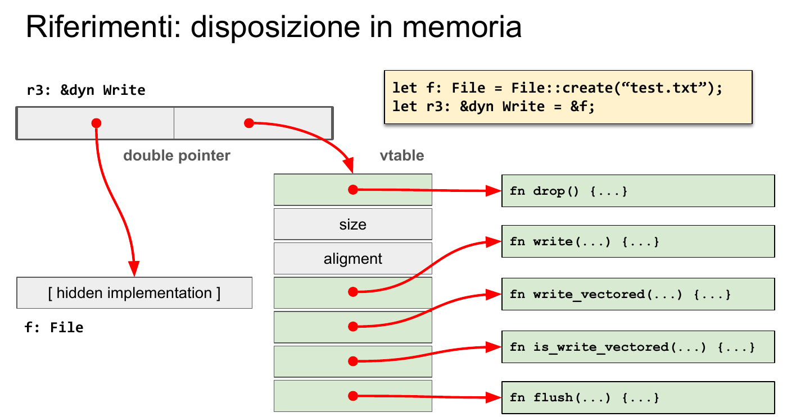
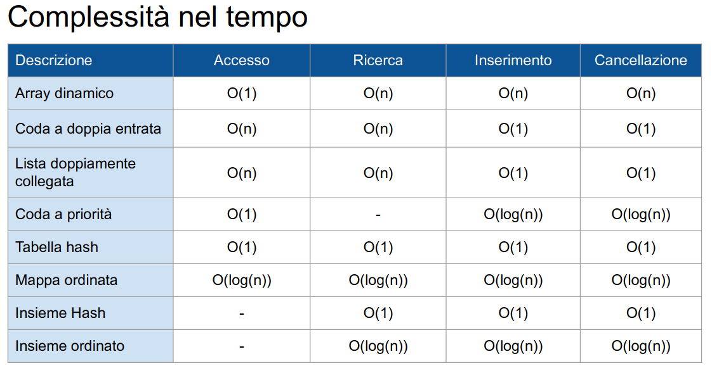
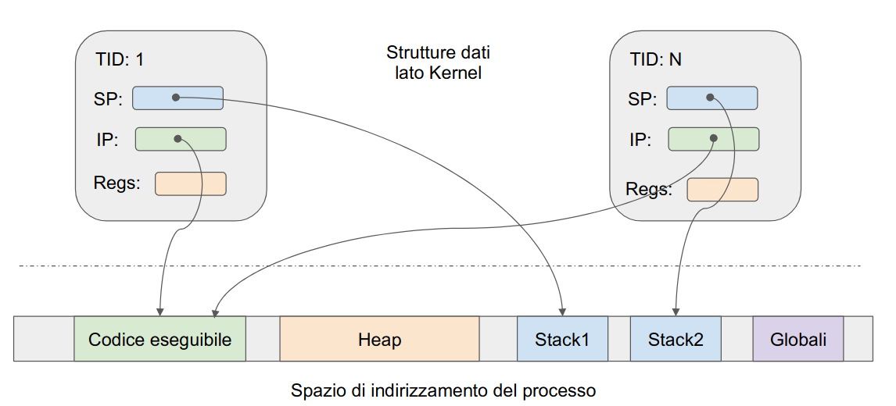
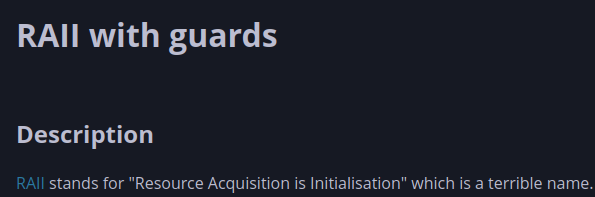

# Lezione del 08/03 - Introduzione a Rust

Il C è stato e per alcune cose è tutt'ora il linguaggio per eccellenza della programmazione basso livello.
Quando fu inventato, grazie ai compilatori, si poté finalmente aggiungere un livello di astrazione al proprio codice rispetto all'assembler, che richiedeva una conoscenza puntuale dell'architettura, finanche dei registri, comunque garantendo le prestazioni ed il controllo sull'hardware a basso livello.

Tuttavia, nel tempo le esigenze dei programmatori sono cambiate, dovuto al fatto che la complessità dei programmi da creare è cresciuta notevolmente nei decenni.
Durante il corso vedremo anche esempi di C++, linugaggio che nasce come un *super-set* teorico del C per introdurre il paradigma di programmazione a oggetti, ma non si limita ad essere solo questo dato che è anche uno dei linugaggi più moderni nella sfera dei linguaggi compilati.

Tuttavia, il lingaggio che studieremo attivamente nel corso sarà Rust, un linugaggio che esattamente come fece C++ nei riguardi del C nasce molto dopo il C++ (C nasce nei primi anni 70, C++ nasce a fine anni 80, Rust nasce a inizio anni 2000) e che come tale punta a risolvere quelle criticità di design che sono emerse nel corso degli anni in C++.

Rust è un linugaggio molto moderno anche nella suite di tool offerti da esso.
Infatti offre supporto nativo per il testing e la gestione di librerie di terze parti, due ambiti dove in C++ la tua miglior speranza è scaricare un `.h` ed un `.c` da internet nella speranza che siano corretti e che siano compatibili con il tuo sistema.

Seppur definito linugaggio ad oggetti, Rust non cade precisamente in questa definizione.
Una più corretta nomenclatura per Rust sarebbe infatti un linguaggio a tipi, dato che implementa anche di base un ricchssimo sistema di tipizzazione.
Tuttavia, per lo stile di programmazione che generalmente si usa, Rust è impropriamente definibile un linguaggio ad oggetti.

La principale evoluzione di Rust rispettto al C++ sta nella sua catena di compilazione.
Se infatti essa è appoggiata ad LLVM, che è la stessa catena di compilazione di C++ e quindi ci garantisce fortissimi livelli di ottimizzazione, Rust aggiunge a tale catena un pezzo pittosto singolare che lo rende un linguaggio unico nel suo genere, vale a dire il Borrow Checker.

Il Borrow Checker è il meccansimo nativo che Rust ci offre come soluzione ai problemi di cui abbiamo parlato sin'ora, ovvero di validità e possesso della memoria.
Esso si assicura che in ogni istante di esecuzione del mio processo le mie variabli e la memoria da loro utilizzata sia valida e abbia uno ed un solo proprietario.
Questo meccanismo è imposto in fase di compilazione, quindi se queste due condizioni non sono assolutamente verificabili, la compilazione fallirà.
Ad esempio:

```C++
void foo(void){
    Dummy *ptr = (Dummy *)malloc(sizeof(Dummy));
    ptr->a = 2048;
    free(ptr);
    ptr->a = 1024; // ?
    free(ptr); // ????
}
```

Prendiamo questo piccolo esempio didattico di C++, in cui sono presenti tutti i classici meccansimi di uso della memoria dinamica: allocazione, accesso, liberazione.
Abbiamo deliberatamente inserito due errori di programmazione.
Il primo è l'accesso a una zona di memoria ormai liberata: qui il programma potrebbe non arrestarsi, in altre parole il comportamento non è definito.
Tuttavia abbiamo la certezza di incappare in un errore fatale, o `SEGFAULT`, chiamando la funzione `free` due volte di seguito sullo stesso puntatore.

Questo codice, di cui è facile verificare la correttezza anche per un programmatore non esperto, passerà comunque la compilazione in C++, forse generando al più un avviso.
In Rust un codice equivalente non sarebbe stato compilabile.
Rust offre anche la possibilità di tracciare altri tipi di errori in fase di compilazione, come l'underflow o l'overflow.

Per via di questo suo stringente controllo di validità, Rust è tra i linguaggi più stabili esistenti ad oggi, se non il più stabile in assoluto.
Tuttavia questo stiringente controllo lo rende anche uno dei linguaggi con la curva più ripida in assoluto.
Filosoficamente parlando, Rust è diametralmente opposto a C e C++:
in questi due linugaggi infatti il programmatore ha la totale libertà di fare qualunque cosa voglia, ma puo' eventualemnte cedere parte di questa libertà per ottenere garanzie di correttezza.
In Rust si parte invece dalla situazione con meno libertà in assoluto e volta per volta, come vederemo, se ne richiede quel tanto che basta per poter ottenere una funzionalità, fermo restando il controllo del compilatore.

Come già detto, installando Rust andremo a installare in realtà non solo `rustc`, che è il compilatore di Rust, ma anche `cargo`, che offre varie funzionalità tra cui la gestione dei panchi, lancio di suite di test, esecuzione dei programmi per monitorare le prestazioni.

Rust obbliga, oltre a una correttezza formale del codice, anche una certa forma nella composizione dei suoi progetti.
Infatti per creare un progetto in Rust abbiamo due modi:
il primo è il comando da CLI `cargo new <project_name>`, che andrà a creare una cartella con nome `<project-name>` e inizializzerà la sua struttura ad albero in un certo modo;
La seconda è, a cartella già create e trovandoci all'interno di essa, il comando `cargo init`, e il progetto prenderà il nome della cartella dentro cui ci si trova.

Che si utilizzi `init` o `new`, varie cose verranno create all'interno della cartella di progetto.
Oltre alle sottocartelle necessarie allo sviluppo ( ad esempio in Rust tutto il sorgente va **necessariamente** all'interno di `<project_name>/src`) ed una repository git, troveremo un file `Cargo.toml` che andrà a descrivere il progetto.

```toml
[package]
name = "firstproj"
version = "0.1.0"
edition = "2021"

[dependencies]
```

Possiamo notare alcuni campi interessanti:
oltre a `name` e `version`, abbastanza auto-esplicativi, troviamo infatti `edition` che ci indica quale versione del linguaggio usare e `[dependencies]`, sotto il quale va riportato l'elenco di pacchetti necessari al nostro programma.

```rust
fn main(){
    println!("Hello World!");
}
```

In Rust così come in C e tanti altri linguaggi, il nostro programma inizia la sua esucizone dalla funzione main.
In Rust per dichiarare una funzione viene impiegata la parola chiave `fn`.
A differenza del C, se non si specifica il tipo di ritorno, esso viene assunto essere `void`, in Rust detto `Unit`, indicato col valore `()`.
Inoltre offre il ritorno di un valore implicito:
infatti se non si inserisce il `;` alla fine di una funzione, il prodotto di quell'istruzione viene automaticamente restituito.

```rust
fn return_unit() {
    println!("Hello World!");
    // implicit return ()
}

fn return_i32() -> i32 {
    println!("Hello World!");
    return 42;
}

fn implicit_return_i32() -> i32 {
    println!("Hello World!");
    42
}
```

Rust a differenza del C permette di non dichiarare il tipo delle sue variabili.
Questo compito verrà delegato al compilatore, ma è possibile che ci sia il bisogno di dichiararlo esplicitamente perché non riesca a dedurlo da solo ( generalmente quando è così abbiamo fatto qualche boiata noi comunque ).
Per dichiarare una variabile si utilizza la parola chiave `let` e di base tutte le variabili in Rust sono immutabili, ovvero, costanti.

```rust
fn foo(x : u32) {...}
    ...
    let x = 5;
    let y : i32 = 5;
    foo(x);
    x = 10; // Non concesso
    ...
```

Analizziamo questo piccolo pezzo di codice.
Notiamo subito che, nella definzione delle funzioni, è necessario specificare il tipo della variabile che si va ad accettare, in questo caso `u32` corrisponde ad un intero senza segno a 32 bit.
Dopodichè, instanziamo due variabili.
Nel primo caso non definiamo il tipo mente nel secondo decidiamo di definirla come `i32`, ovvero intero su 32 bit con segno.
In questo contesto il compilatore, vedendo che passiamo `x` alla funzione `foo` che accetta un `u32` come parametro, associerebbe ad `x` il tipo `u32`.
Infine come detto tutte le variabili in Rust sono di base immutabili, quindi l'istruzione `x = 10` farebbe fallire la compilazione.

Per permettere che il valore di una variabile venga modificato è necessario usare la parola chiave `mut` in fase di dichiarazione della variabile.

Chiudiamo la lezione inoltre illustrando l'uso della macro (e non funzione, ne parleremo più avanti) `println!` che stampa un messaggio sullo standard output, interpolando i valori passategli come farebbe un'analoga `printf` in C o C++ usando il segna-posto `{}`.

```rust
let mut x = 0;
println!("x is {}", x); // "x is 0"
x = 10;
println!("x is {}", x); // "x is 10"
```

# Lezione 09/03 -- Introduzione a Rust II

Come già detto Rust offre un ricchissimo sistema di tipizzazione, che è necesario esplorare prima di addentrarsi in dettagli funzionali ben più complessi.
Tuttavia, essendo Rust come già detto non un vero linguaggio ad oggetti, esso non ha una struttura gerarchica dei tipi di dato, ma raggiunge le sue funzionalità tramite i tratti, su cui il linguaggio si basa e usa in maniera intensiva, di cui parleremo più avanti.

Parlando del valore di `null` in Rust, abbiamo detto che è noto come `Unit` ed è indicato dal simbolo `()`.
In realtà `()` sta ad indicare un tipo ben specifico di dato, la tupla, che è a nostra disposizione in maniera nativa. 
Segue le regole descritte finora delle variabili e permette etorgeneità dei dati.
È possibile accedere al dato in una data posizone come `tupla.n` con `n` numero del dato cui si vuole accedere

```rust
let t = (1, 2, 3);
let x = t.1; // x = 2
t.0 = 4; // No! La tupla è immutabile
let mut t2 = (1, 2, 3);
t2.0 = 4; // Ok! La tupla è mutabile
let t3 : (i32, mut i32, i32) = (1, 2, 3);
t3.1 = 4; // Ok! La tupla è immutabile ma il suo secondo elemento è mutabile
let t4 : (i32, f32) = (1, 2.0); // Totalmente ok
```

Tuttavia, l'interesse principale ai tipi di Rust è da dedicarsi ai rierimenti perché sono strettamente legati alla funzionalità più unica del linugaggio, il Borrow Checker.

In Rust deve essere in ogni momento definito il proprietario di una variabile, ma questo proprietario puo' prestare una variabile ad un altro, in due modi doversi: prestito mutabile e prestito immutabile.
Va da sé che un prestito mutabile permetterà la modifica della variabile ed un prestito immutabile no.

La cosa cui dobbiamo stare attenti è che, esattamente come non è asolutamente problematico che molte persone leggano da una singola variabile costante potrò cederla infinite volte, mentre un prestito immutabile deve essere fatto uno per volta e con nessuno che possegga un prestito immutabile nel mentre.
Si indica con `&var` il prestito immutabile e con `&mut var` il prestito mutabile.

```rust
let x = 10;
let y = &x;
println!("{}", y); // 10
println!("{}", x); // 10
```

Nel caso descritto qui sopra, `x` rimane il proprietario mentre `y` la ha solamente in prestito.
Questo non crea problemi con l'esecuzione delle due print in quando tutte le operazioni che stiamo eseguendo sono solo ed unicamente in lettura.
La situazione cambia radicalmente quando:

```rust
let mut x = 10;
let y = &mut x;
println!("{}", y); 
println!("{}", x); 
```

Questo codice non passerebbe la compilazione in Rust.
Anzitutto notiamo l'aggiunta della parola chiave `mut` dinanzi ad `x`:
questo è dovuto al fatto che ovviamente non è possibile cedere un prestito mutabile di una variabile che è immutabile.
Tuttavia la compilazione fallierebbe per via della `println!` su `x`.
Questo perchè internamente per richiamare la funzione di stampa è necessario prendere in prestito immutabile la variabile;
tuttavia come descritto sopra, i prestiti mutabili sono incompatibili con i prestiti immutabili, il borrow checker si accorge di questa situazione e fa fallire la compilazione.

Sebbene quindi fin qui i riferimenti in Rust possano apparire molto simili ai puntatori del C++, alcune differenze sono nette.
Infatti Rust che si pone come obiettivo quello di eliminare i comporatamenti indefiniti, rende impossible la creazione di un caso in cui si abbia un riferimento nullo.
L'utilizzo delle referenze in modo esclusivo, secondo una politica singolo scrittore **o** multipli lettori, garantisce questa particolarità.

Quanto detto finora vale per le variabili locali, tuttavia è comune una casistica in cui si voglai avere un oggetto allocato sulla memoria di heap, magari per estenderne il tempo di vita.
In quel caso il linguaggio offre il tipo `Box<T>`, che è anche quindi il primo esempio di programmazione generica su tipo `T` che andiamo a vedere.
Il tipo dato `Box` è molto più simile a quello che definiremmo un puntatore in C++, e infatti come anche essi permette la dereferenziazione per l'accesso al dato mediante l'operatore `*`.

```rust
let v = vec![1, 2, 3]
{
    let box = Box::new(v);
    println!("{}", *box); // "1, 2, 3"
}
// `box` distrutta, `v` rilaciato
```

Nel caso delle Box, il dato da loro contenuto terminerà la vita quando la referenza della Box verrà distrutta.
Tuttavia in alcuni casi estremi, puo' essere necessario l'uso di puntatori nativi stile C.
Per questi casi Rust definisce una parola chiave da usare con cautela, denominata `unsafe`, che non viene sottoposta al controllo del Borrow Checker.
In questo tipo di blocchi è consentito l'uso di puntatori come `*const T` e simili, ma bisogna evitare di utilizzarli quando non strettamente necessario ( quasi mai ).

Passiamo ora agli array, che in Rust sono resi idiomaticamente ricchi.
I modi per dichiarare un array possono inizialmente confondere, questo perché ci sono più modi di dichiarare ed inizializzare un array in una sola riga a seconda delle esigenze. 
È bene notare che ciò scaturisce dal fatto che in Rust, a differenza di quanto accade in C++, non è possibile instanziare un array senza definirne il contenuto.

```rust
let a : [i32; 5] = [3, 3, 3, 3, 3];
let b = [3; 5];
```

Questi sono due modi del tutto equivalenti di produrre lo stesso array.
Nel primo caso annotiamo il tipo e la sua lunghezza, per poi successivamente definirne il contenuto.
Nel caso volessimo tutti elementi uguali, come qui, la seconda scrittua permette di creare un array secondo la notazione `[valore_iniziale; lunghezza_array]`.

Se invece avessimo bisogno di un array di dimensione variabile, quindi la cui dimensione non è necessariamente nota in fase di compilazione e con la possibilità di essere eventualmente allargato, si puo' ricorrere al tipo `Vec<T>`.

Anche in questo caso, gli array vivono nello stack mentre i Vec vivono nello stack.
Per instanziare un `Vec`, è sconsigliato l'uso del costruttore `Vec::new()` che porterebbe a un vettore inizialmente nullo che dovrà essere riallocato più volte inizialmente, ma è consigliabile utilizzare la comoda macro `!vec[]` oppure la funzione `with_capacity` per dichiarare da subito una dimensone minima da poter sostenere.

```rust
let v1 = vec![1, 2, 3];
let v2 : Vec<i32> = Vec::with_capacity(3);
```

Anche qui come nei casi precedenti il tipo viene automaticamente dedotto quando possible.
Nella seconda riga il compilatore non riuscendo a farlo potrebbe avere bisogno dell'annotazione.

Notiamo una cosa:

```rust
let v : Vec<i32> = Vec::with_capacity(3);
let x = v[0];
println!("{}", x);
```

Notare che il codice qui sopra è un codice che passerebbe tranquillamente la fase di compilazione di Rust, nonostante non si sappia che valore `x` abbia e abbiamo finora parlato dei grandi sforzi per non ottenere comportamenti indefiniti.
Tecnicamente parlando, il comportamento in questo caso è ben definito:
facendo accesso fuori posizione al vettore, il programma chiamerà la macro `panic!()` che arresterà brutalmente in programma.

Un ultimo modo per fare riferimento agli array sono le Slice.
Esse sono analoghe a come presenti in altri linguaggi che le hanno popolarizzate, come Python, e permettono appunto di ottenere un riferimento a una porzione di un array la cui dimensione potrebbe non essere nota in fase di compilazione.

Le slice vengono inoltre gestite come dei `fat pointers`, che indicano all'interno della variabile cui sono memorizzati l'area di memoria dove effettivamente risiedono e la loro dimensione.

```rust
let v = [1, 2, 3, 4, 5];
let s = &v[1..3]; // Operatore di range, vedere avanti

println!("{}", v); // 1, 2, 3, 4, 5
println!("{}", s); // 2, 3
```

Parliamo ora delle stringhe, una delle parti dove il design di Rust è più vivido che mai.
Di base abbiamo due tipi ben speficific: `String` e `str`.

`str` rappresenta dei tipi di caratteri con codifica Unicode, memorizzati staticamente.
Non è un tipo direttamente manipolabile quindi per utilizzarli come stringa bisogna far riferimento alle loro slice, `&str`.

`String` invece è più un tipo da intendere come un buffer.
A differenza di `&str` la sua dimensione non è infatti fissa e puo' espandersi quando necessario.
Fare attenzione perchè, essendo appunto un buffer, ha a disposizione due chiamate a funzioni per ottenere la sua lunghezza: una restituisce la dimensione del buffer, l'altra il numero di caratteri in esso presenti.
Non solo, ma internamente sia `&str` che `String` sono implementate come un buffer `&[u8]`, ovvero una serie di byte, quindi anche quando il buffer è interamente pieno, è garantito che le due dimensioni non coincidano.

La presenza di questi due tipi puo' inizialmente sembrare strana, soprattutto dovendo scegliere quando usarli.
La realtà dei fatti tuttavia, è che spesso è necessario usarli entrambi:
per le chiamate a funzioni, o comunque per operazioni che non richiedano la modifica della stringa, è preferibile l'uso di &str, mentre per quel che riguarda la manipolazione delle stringhe, essendo le slice di dimensione fissa, bisogna utilizzare String.

Passiamo ora a parlare di istruzioni per l'iterazione.
Il costrutto `while` permette di iterare il blocco fintanto che la condizione è verificata:

```rust
let mut n = 0;
while n < 10 {
    n += 1;
}
println!("{}", n) // 10
```

mentre i costrutto `for` è ispirato a linguaggi moderni che hanno abrogato l'accesso tramite indice, usando implicitamente gli iteratori, di cui parlerermo approfonditamente più avanti.

```rust
let vec = vec![1, 2, 3];
for v in vec {
    println!("{}", v);
}
// 1... 2... 3...
```

Aggiunge tra le altre cose un operatore per creare cicli infiniti, ovvero da rompere esplicitamente usando una istruzione `break`.

```rust
let mut n = 0;
loop {
    n += 1;
    if n == 10 {
        break;
    }
}
println!("{}", n) // 10
```

Questi tipi di cicli possono anche essere annidati ed etichettati, in modo da poter rompere un ciclo esterno da un ciclo interno:

```rust
let mut n = 0;
'outer : loop {
    'inner : loop {
        break 'outer;
    }
    n = 100;
}
println!("{}", n) // 0
```

Volendo tuttavia utilizzare qualcosa di più simile ai metodi tradizionali del C, anche sol puramente per comodità, il linguaggio rende più conciso anche quello grazie al tipo `Range`.
Esso infatti ci permette di definire delle sequenze crescenti di valori tramite gli operatori `..` e `..=`.
Nel primo caso, l'ultimo numero è escluso dall'insieme, mentre nel secondo è incluso.

```rust
let inclusive_range = 0..10 // Ultimo elemento: 9
let exclusive_range = 0..=10 // Ultimo elemento: 10
let even_nums = 0..=10.step_by(2) // 0, 2, 4, 6, 8
```

Non è possible creare dei range decrescenti, ma è possibile iterare su di essi al contrario.

```rust
let inclusive_range = 0..=10;
let reversed = inclusive_range.rev(); // 10, 9, 8, ...
```

Un'istruzione singolare in Rust, per via della sua potenza, è il costrutto `match`.
Esso è analogo a quello che era la parola chiave `switch` in C/C++, ma è molto più forte, tanto che intere funzioni molto complesse sono riscrivibili in termini di solo `match`.

```rust
let x = random_number();
match x {
    0 => println!("zero"),
    10..=20 => println!("ten to twenty"),
    value if value < 5 => println!("less than five"),
    30 | 60 => println!("thirty or sixty"),
    _ => println!("other"),
}
```

Infine, il lingaggio ha anche una sua convenzione sull'estetica del codice.
Infatti se fin'ora il codice ha seguito uno stile di scrittua `snake_case` è perché questa è quella ufficialmente adottata dal compilatore che, nel caso in cui venga infranta, rilascia dei warning.
Infine, tramite il comando `cargo fmt`, è possibile eseguire la formattazione, indentazione, etc. di tutto il codice sorgente del progetto.# Lezione 11/03 - Possesso

Torniamo ora sul tema del possesso in Rust.
Come già detto, una variabile usata nel linguaggio viene create in modo tale da avere in ogni momento dell'esecuzione un valore valido ed un proprietario.
Controllare, inteso come possedere, una variabile, significa avere il potere leggerla e modificarla.

Il possesso di una variabile, inteso come la variabile che passa all'avere nessun proprietario, avviene nel momento in cui la sua memoria viene rilasciata, idiomaticamente detto `drop`.
Quando si giunge al termine di un blocco di codice, detto `scope`, viene automaticamente eseguito il `drop` di tale variabile implicitamente.
Il `drop`, come tutto in Rust, è definito tramite un tratto, il tratto `Drop`, che non permette di modificare il comportamento di liberazione della memoria ma permette di eseguire delle operazioni preliminari alla liberazione.

```rust
let x = 5;
{
    let b = 0;
    ...
    // chiamata implicita a drop(b)
}
drop(x);
// Ora x non è più una variabile valida
```

Notiamo una particolarità del linugaggio.
In C, non esistendo il concetto di movimento di una variabile, ogni assegnazione viene eseguita per copia.
Vale a dire, un'istruzione come `a = b`, copierà il contenuto di `b` in `a` lasciando inalterato `b`.

In C++ è pratica comune aggiungere un livello di astrazione, andando a definire un operatore di movimento, ovvero un operatore tale per cui, eseguendo `a = b`, il contenuto di `b` viene copiato in `a` e `b` viene svuotato.
Questo viene più spesso definito per gli oggetti in C++ visto che per i tipi di base ha meno senso.

In Rust il comportamento è diametralmente opposto in quanto, a differenza del C e del C++, di base tutto avviene tramite movimento, e solo intenzionalmente possiamo andare a copiare il contenuto di un tipo complesso ( vedremo avanti due tratti per raggiungere questo obiettivo ) oppure solo esplicitamente passare la referenza all'aria di memoria, ovvero un riferimento.

```rust
let mut s1 = "hello".to_string();
let s2 = s1;
println!("s2: {}", s2);

// s1 non è più accessibile, vita in termine dato terminata
```

Tuttavia, dal punto di vista del linguaggio tra copia e movimento non esiste differenza per via della presenza del *borrow checker*, che semplicemente impedisce comportamenti che con il movimento non sarebbero possibili. 


```rust
let point = (1.0, 1.0)
let reference = &point;
println!("({}, {})", reference.0, reference.1);
```

In questo caso `reference` puo' fare accesso alla variabile in sola lettura solo fintanto che la variabile `point` esiste. 
`reference` non possiede il dato quindi non puo' modificarlo e tantomeno non puo' distruggerlo. Per questo motivo i riferimenti sono copiabili, poichè è essenzialmente la copia di un puntatore.
In più, a differenza di C/C++, il compilatore fa in modo che il riferimento non possa essere compilato in una porzione di codice che mette in pericolo la vita del dato.
Per questo esiste la differenza logica tra puntatore e riferimento, poichè il puntatore è un contenitore ad un indirizzo di memoria generico, non solo non tipizzato ma potenzialmente non valido, mentre un riferimento non solo è tipizzato ma grazie alla compilazione ci assicura sia sempre valido.

Per garantire questi meccanismi il linguaggio abilita il i riferimenti mutabili, ma solo una volta. Questo vuol dire ad esempio:

```rust
let v = "String"
let r = &v; // Ok
let r2 = &v; // Errore, solo UN riferimento mutabile è concesso
```

Questo perchè chiaramente l'operazione di mutabilità tira un po per le braccia il concetto di possesso, e quindi il linguaggio impone alcuni limiti. 
Per via di ciò, nel prestito è possibile eseguire la copia del riferimento mentre nel prestito mutabile è concesso solo il movimento in quanto solo un riferimento è concesso.
Il prestito mutabile impone anche che la variabile passata in prestito non è accessibile in alcun modo perchè quella variabile, fintanto non riprende controllo del dato, è interamente rimossa dallo scope.

```rust
let mut s = String::from("Hello");

{
    let m = &mut s;
    println!("{}", s); // Errore, s non esiste come variabile 
}

println!("{}", s); // Ok
```

Problema comune del linguaggi C è anche che i puntatori non hanno idea di che tipo di dato stiano puntando.
Per fare un esempio, un `int*` potrebbe essere:

- Un riferimento a un singolo intero in memoria
- Il primo elemento di un array di interi
- I primi byte di un dato più lungo, tipo `long*`

In Rust tale comportamento "agnostico" non è concesso, infatti tutti i puntatori, in Rust dette referenze, sono talvolta chiamati *fat pointers*, poichè oltre ad avere appresso l'indirizzo dove il dato è memorizzato, portano con se dei dati accessori per sapere le dimensioni dell'area di memoria e del tipo di dato.

È interssante prendere un attimo per discutere ad esempio dei duppi puntatori, in C banalmente utilizzati per ottenre ad esempio delle matrici.

Il tipo `dyn` in Rust permette di definire che non si conosce esplicitamente il tipo di dato puntato ma si sa che implementa alcuni tratti e che quindi espone alcune funzioni.
La refernza a un tipo `&dyn` quindi, che potrebbe essere di qualunque tipo, esplica quindi solo le funzionalità che esso puo' offrire.

Ma se non conosce il tipo, e quindi non ne conosce nemmeno la dimensione, quello che si viene a creare in memoria è qualcosa di simile a questo.



Ovvero il puntatore doppio, o comunque annidato, è diviso in due parti:
la prima che punta realmente al tipo di dato, la seconda che punta a una tabella virtuale dove sono presenti le chiamate funzioni cui il tipo puo' accedere.
Questo accade perché, a differenza di quanto avviene in C o C++, il compilatore non per forza va a sotituire le chiamate a funzioni con delle istruzioni di salto all'atto della compilazione, andando invece a recuperare il puntatore a dove quella funzione è memorizzata in memoria quando il programma è in esecuzione.
# Lezione del 21/03

Il concetto di controllo di una variabile essenzialmente esprime la scelta di cosa possa essere mutabile e cosa no.
Facendo un uso frequente di questo concetto, posso anche evitare situazioni ambigue in cui per errore ho modificato una variable che invece doveva rimanere invariata

Tuttavia un sistema così costruito, e che adoperi anche un borrow checker, è molto complicato da saper usare.
Nello spettro diametralmente opposto trovo invece il C, dove il concetto di possesso non è definito dal linguaggio ed inoltre la mutabilità è alla base del linguaggio, con la non mutabilità che è richiesto dal professore.

Infine il linguaggio espone anche 3 paradigmi di accesso alle risorse: accesso puntuale al dato, accesso in sola lettura al dato, accesso in scrittura vincolato al possedere il dato.

L'accesso alla riga di comando è orientato alla programmazione funzionale, a differenza del C, dove i parametri sono una matrice di caratteri, o un vettore di stringa che dir si voglia.

```rust
use std::env::args;
fn main() {
    let args: Vec<String> = args().skip(1).collect();
    if args.len() > 0 {
        // We have args and we can use them
    }
}
```

Notiamo l'uso della funzione `skip()` per saltare il primo parametro che rimane comunque il nome del programma chiamato e l'uso di una `collect()` per convertire i parametri da riga di comando in un vettore di stringhe.

Per l'IO, la libreria standard contiene tutto quel che è necessario per interfacciarsi ad esso.
Le informazioni ritornate da tali funzioni spesso non sono il dato vero e proprio ma, come spesso accade in Rust per indicare comodamente la corretta esecuzione di una funzionalità, di una `Result<>`.

`Result` mette a disposizione due funzioni per capire istantaneamente se l'esecuzione è andata a buon fine: `is_ok()` e `is_err()`.
Dopo aver verificato, possiamo accedere al dato con con la funzione `unwrap()` che dobbiamo star attenti a richiamare solo dopo la verifica, perché se si tentasse di eseguirla su su una `Result<>` che ha in realtà ritornato un errore, il programma avvierebbe un `panic!()`.

```rust
let mut string = String::new();
if io::stdin().read_line(&mut string).is_ok() {
    prinln!("Got {}", s.trim()); 
}
```

**Seguono due ore di code review abbastanza dimenticabile**

La programmazione ad oggetti richiede di concepire, prima dell'algoritmo, come i nostri dati sono stati strutturati.
In C il costrutto `struct` permette di creare appunto strutture dal contenuto eterogeno, ma non è un linguaggio propriamente orientato agli oggetti come lo è ad esempio il C++.
Notiamo che dal punto di vista del compilatore le due cose sono equivalenti se non per l'accesso ai dati:
di base in una `struct` tutti i campi sono pubblici, mentre nei linguaggi ad oggetti possiamo dichiararli come privati o protetti.

Due tipi di dato presenti in C/C++ e spesso trascurati sono gli enumeratori e le union.
I primi permettono di associare un etichetta ad un valore puramente numerico, mentre i secondi permettono di interpretare un dato come due tipi diversi a seconda delle esigenze.

Un esempio di union in C++:

```C++
union sign {
    int svar;
    unsigned int uvar;
} number;
```

Questo è un esempio è un caso molto comodo.
Infatti, in questo caso, sia `int` che `unsigned int` occupano la stessa memoria.
Quindi è vero che io potrei utilizzare la dichiarata variabile `number` sia come intero che intero senza segno, qualora lo reputassi necessario, ma questo avrebbe un costo nullo.

Se infatti avessi provato a definire una union tra due tipi di dato di dimensione diversa, come ad esempio un `long` che occupa più byte di un `int`, di base ogni variabile di tipo `sign` che andremmo a dichiarare, dovendo poter accogliere entrambi i tipi di dato, si allineerà alla dimensione del dato più grande.# Lezione del 22/03

Rust non è propriamente un linguaggio di programmazione ad oggetti, ma sarebbe più corretto definirlo un linguaggio per tipi.
Nonostante ciò, possiamo definire strutture dati che per tanti aspetti sono funzionalmente indistinguibili da quello che normalmente ci aspetteremmo in un linguaggio ad oggetti.
 
In Rust la dichiarazione di una struttura viene divisa in due parti.
La prima, quella con la dichiarazione dei dati, la seconda è la sua implementazione dove troviamo i metodi ad essa associata.
Per queste due azioni, si utilizzano rispettivamente le parole chiavi `impl` e `struct`.
È anche presente una parola chiave `self` che prende il ruolo di analogo alla più comune `this`.
Quind un codice come questo in C++:

```C++
class Something {
    int i; // Dati
    String s;
    void proces() {...} // Metodi
    int increment() {...}
}
```

In Rust avrebbe queste sembianze:

```rust
struct Something {
    i : i32,    // Dati
    s : String
}

...

impl Something {
    fn process(&self) {...} // Metodi 
    fn increent(&mut self) {...}
}
```

Notiamo cone in Rust ogni "metodo" accetti come primo parametro una qualche referenza a `self`, di cui parleremo meglio nel dettaglio, e che a differenza di altri linguaggi, in metodo non dichiarato esplicitamente come pubblico (`pub`) è di base privato.

La chiamata a funzione è concessa come `istanza.funzione` oppure `struct.funzione(istanza)`

```rust
impl str {
    pub const fn len(&self) -> usize {...}
}
...
let str1 : &str = "abc";
println!("{}", str1.len());
println!("{}", str::len(str1));
```

`self` puo' essere gestito in vari modi, che corrispondono a diversi modi di intendere chi possieda `self` infatti.
Infatti indicando `self` come parametro, non esistendo di base il concetto di copia in Rust, quel che staremmo attuando è un movimento, vale a dire che nel moemnto in cui richiamo la funzione su un dato, il vecchio dato risulterà mosso e quindi non più utilizzabile

Ovviamente se questo fosse l'unico modo di utilizzare le funzioni, sarebbe pittosto sconveniente, e infatti è possibile passare una referenza in sola lettura alle funzioni, che quindi non consentono la modifica dei dati all'interno della struttura, ed una che invece cede momentaneamente il possesso della variabile per eseguirne la modifica, rispettivamente `&self` ed `&mut self`.

In Rust a differenza di altri linugaggi non esiste propriamente il concetto di costruttore o distruttore.
Questo non significa che le nostre strutture ci compaiano tra le mani per magia, ma che tocchi quindi a noi implementare i metodi per ottenere le istanze delle strutture.

Tuttavia, per rimanere più vicini al concetto di programmazione ad oggetti, per convenzione la funzione che inizializza i campi di una struttura è comunque chiamata `new`, mentre il tratto `Drop` permette di eseguire alcune operazioni preliminarei prima che il SO liberi le risorse da esse occupate.

Qui vediamo un primo esempio di come implementare un tratto per una funzione, che funzionalmente potremmo inquadrare in quelle che sono le interfacce in Java.

```rust
pub struct Shape {
    ...
}

impl Drop for Shape {
    fn drop(&mut self) {
        println!("Dropping shape");
    }
}
```

Parleremo dopo della differenza tra `Copy` e `Clone`, ma questa è una occasione per notare che in Rust alcuni tratti possono essere mutualmente esclusivi, ovvero che una struttura che implementi un tratto `A` non possa implementare un tratto `B`
In questo caso ad esempio, un struttura che implementa il tratto `Drop` non puo' implementare il tratto `Copy`.

È consentito l'utilizzo di metodi statici, ovvero metodi che non appartengono ad una istanza della struttura ma alla struttura in sè.

Questo è concesso tramite la parola chiave `static`, e non richiedono ovviamente il parametro `self` come primo argomento.
Questo è anche il modo in cui si possono implementare alcuni pattern molto noti, come il `Singleton`.

Passiamo ora a parlare di una funzionalità che in Rust è stata molto arricchita rispetto al C, gli enumeratori.
Qui non solo possiamo definire un'etichetta senza per forza definirne il valore o definirle fuori seqeuenza.

```rust
enum HTTPResponse {
    OK = 200,
    NOTFOUND = 404,
    INTERNALERROR = 500
}
```

Una differnza sostanziale rispetto ad altri linugaggi è che possiamo anche definirli anche come un tipo di somma o come un dato specifico, ovvero un `enum` in rust puo' contenere l'unione dei valori di dato delle singole etichette.
Tuttavia facendo ciò bisogna tener conto che si applicano dei crietri esattamente opposti a quelli degli `enum`.


 
Questo perché, dovendo potenzialemnte ospitare più etichette contemporaneamente dello stesso enumeratore, di base Rust allineerà la memoria per poterli contenere potenzialmente tutti.

Gli enumeratori possono quindi fare uso di clausole `match` per aumentare il nostro livello di astrazione.

```rust
enum Shape {
    Square { s: f64 }
    Circle { r: f64 }
    Rectangle { w: f64, h: f64}
}

...

match my_enum {
    Square { s } => s*s
    Circle { r } => r*r*3.1415
    Rectangle {w, h} => w*h
}
```

Avevamo prima parlato della `Result<>` in Rust.
Esiste un altro modo, anche esso largamente utilizzato nel lingauggio ma non collegato alla corretta esecuzione di un programma ma alla validità o meno di un dato, che è la `Option`.

Se nella Result abbiamo, per costruire una istanza corretta la funzione `Ok(valore)` e quella `Err(errore)`, qui quel che abbiamo sono invece le funzioni `Some(valore)` ed il tipo `None` comune a tutte le `Option`.
Anche in questo caso è molto comodo gestire i due casi tramite l'uso di clausole `match`. 

```rust
fn plus_one(x: Option<i32>) -> Option<i32> {
    match x {
        None => None,
        Some(i) => Some(i+1)
    }
}

// Oppure

fn open_file(n: &str) -> File {
    match File::open(n) {
        Ok(file) => file,
        Err(_) => panic!("Error")
    }
}
```

Rust, non essendo un linugaggio prettamente ad oggetti, non consente un uso del polimorfismo nel senso classico, ma lo stesso potrebbe dirsi del C++ che implementa tale concetto nei limiti imposti dal linguaggio tramite una VTABLE, che è anche a grosse linee la scelta intrapresa da Rust.

Questo approccio puo' sembrare strano, più correttamente limitante, ma come abbiamo detto prima Rust è più propriamente un linguaggio per tipi o per tratti, che punta a non delegare al programmatore la gestione della linea ereditaria ma esplicitare tramite essi le capacità delle strutture.# Lezione del 04/04 - Rust e Polimorfismo

Come già detto Rust non è propriamente un linguaggio ad oggetti in quanto non implementa un vero e proprio meccanismo di ereditarietà.
Per via di ciò il polimorfismo qui è inteso come il dare funzionalità comuni a strutture diverse attraverso i tratti.

Il meccanismo dei tratti se vogliamo è ispirato al concetto delle interfacce in altri linguaggi.
Su di essi il linguaggi implementa tutte le funzionalità di base e non solo.

Ad esempio in Rust possiamo stampare una variabile in due modi differenti, ossia facendo interpolazione dei caratteri `{}` all'interno di una stringa o dei caratteri `{:?}`, con la differenza che nel secondo caso stiamo chiedendo la stampa in modalità Debug del dato.
Questo comportamento è definito secondo un tratto.

La sintassi è fondamnetalmente simile a quanto visto in altri linguaggi, ma il principio è avere una funzione che definisce il tratto. 

```rust
// Definizione del tratto

trait Something {
    fn someOperation(&mut self) -> SomeResult; 
}

...

// Implementazione

impl Something for SomeType {
    ....
}
```

Uno delle inconvenienze tipice della programmazione è la scrittura frequente di pezzi di codice triviali.
Per alcuni tratti ed alcune casistiche, Rust permette di ovviare a tale cosa.

Quando si vuole utilizzare questa caratteristica invece iniziano i mal di testa. Il linguaggio offre quetsa possibilità in due modi. Ad esempio:

```rust
trait Default {
    fn default() -> Self;
}
```

Questa funzionalità non ha parametro quindi non la posso applicare ad una struct, e pertanto va richiamato con la sintassi `Default::default()` e pertanto è detta riflessiva, come fosse un metodo statico di altri linguaggi, ma possiamo anche dire che è possibile chiamarlo facendo riferimento al tipo.
Questo significa che è possibile definire prima il tipo da cui il compilatore andrà a recuperare il metodo per tale tipo, se implementato

```rust
fn main() {
    let zero: i32 = Default::default(); // i32::default() richiamato implicitamente
    let zero_again = i32::default();    // i32::default() richiamato esplicitamente
}
```

Tecnicamanete il parametro self sarebbe il nome richiamato all'interno della funzione e sarebbe `Self` con la S maiuscola, con tutte le variazioni desiderabili di `&Self` e `&mut Self`.

```rust
trait T2 {
    fn takes_self(self);
    fn takes_self_again(self: Self);    // Equivalenti
}
```

In Rust posso anche definire un tipo come secondario, in modo da essere richimato con più facilità.
Questo concetto è meglio assimilato tramite un esempio, quindi facciamo finta di star implementando una struttura `Containter` che vuole implementare un tratto detto `Contains`:

```rust
trait Contains {
    type A;
    type B;
    ...
}
```

Le funzioni che vogliono utilizzare il tratto Contains una volta che esso è stato implemntato per una struttura ora non dovranno più esplicitarlo.
Per confronto, proviamo ad implemenare la funzione `contains` prima senza i tipi associati e poi con.

Senza:

```rust
trait Contains<A, B> {
    fn contains(&self, _: &A, _: &B) -> bool;
}

impl Contains<i32, i32> for Container {
    fn contains(&self, _: &A, _: &B) -> bool {
        ...
    }
}
```

Ora vediamo la sintassi con il tipo associato:


```rust
trait Contains {
    type A;
    type B;
    
    fn contains(&self, _: &Sefl::A, _: &Self::B) -> bool;
}

impl Contains for Container {
    type A = i32;
    type B = i32;
    fn contains(&self, _: &i32, _: &i32) -> bool {
        ...
    }
}
```

L'uso dei tipi associati consente anche di non dover specificare affatto i tipi cui si fa riferimento dopo averli definiti.

```rust
fn difference<A, B, C>(container: &C) -> i32 where C: Contains<A, B> {...} // Senza tipi associati

fn difference<C: Contains>(container: &C) -> i32 { ... } // Con tipi associati
```

Come visto in altri linguaggi è possibile, in fase di definizione di un tratto, definire delle implementazioni di default delle funzioni che vanno a richiedere, in modo da lasciarle inalterate qualora non sia strettamente necessario la loro ridefinizione.

```rust
trait Tratto {
    fn f(&self) {
        println!{"Default action, not implemented"}
    }
}

struct Struttura {
    ...
}

impl Tratto for Struttura;

let struttura = Struttura;
struttura.f(); // "Default action, not implemented"
```

Sebbene Rust non abbia una linea di ereditarietà delle strutture, esso dispone di una linea ereditaria dei tratti.
Posso cioè definire per un tratto un suo sottotratto, che rende automaticamente il tratto originale un supertratto.
Questo crea però delle ambiguità nel caso delle chiamate a funzioni, che se vengono re-implemenate hanno bisogno di esplicitare quale delle due si va a chiamare.

```rust
trait Supertratto {
    fn f(&self) { println!{"Supertratto"}}
}

trait Sottotratto : Supertratto {
    fn f(&self) { println!{"Sottotratto"}}
}

struct Struttura {
    fn new() -> Self {
        Struttura
    }
}

impl Supertratto for Struttura {} // Impl. di Default
impl Sottotratto for Struttura {} // Impl. di Default

fn main() {
    let struttura = Struttura::new();
    Sottotratto::f(&struttura); // "Sottotratto"
    Supertratto::f(&struttura); // "Supertratto"
}
```

Come già accennato altre volte, grazie ai tratti possiamo richiedere di non conoscere esplicitamente il tipo di dato su cui una funzione va a lavorare ma a richiedere al compilatore che esso implementi i tratti necessari.
Per fare ciò si fa uso della parola chiave `dyn` che accetta un tratto o una combinazione di tratti.

```rust
trait Stampa {
    fn stampa(&self);
}

impl Stampa for Struttura {
    fn stampa(&self) {
        println!{"Stampa struttura"};
    }
}

fn process( val: &dyn Stampa) {
    val.stampa();
}

fn due_tratti_richiesti(val: &dyn Stampa+Clone) {
    val.stampa();
    val.clone();
}
```

Per far si che la cosa funzioni, la referenza a `dyn` è un fat pointer che include una referenza al dato, più nello specifico un'istanza della struttura ovvero quella su cui si chiama il tipo, e l'altro a una tabella virtuale che contiene i puntatori alle funzioni da richiamare.
A runtime, quando si richiama la funzione sul tipo $dyn Tratto$, si consulta la tabella per ottenere il puntatore e poi tale funzione è eseguita.
Potremmo dire che, come in C, il puntatore al dato è un puntatore generico, come fosse un `void *`, e come tale porta delle leggere inefficienze che il compilatore non puo' superare in quanto questo funzionamento è gestito a runtime.

In Rust non esiste l'overloading degli operatori.
Di fatto, quando chiamiamo Rust in linugaggio per tratti, è anche dovuto al fatto che persino la ridefinizione degli operatori di somma, sottrazione e quant'altro è gestito tramite i tratti.

Per ridefinire l'operazione di somma di una struttura:

```rust
impl Add for Struttura {
    type Output = Struttura;
    
    fn add(self, other: Struttura) -> Struttura {
        // La nostra operazione di somma
    }
}
```

La cosa interessante di modo di operare è che è persino possibile ridefinire tali operazioni per tipi di dato etorgenei.
Anche qui, un esempio chiarisce subito il concetto:

```rust
use std::ops::Add;

struct Punto {
    x: i32,
    y: i32,
}

impl Add<i32> for Punto {
    fn add(&self, other: i32){
        Punto {
            x: self.x + other,
            y: self.y + other,
        }
    }
}

...

let p = Punto(3, 4);
println!("{}", p); // { x: 3, y: 4 }
println!("{}", p + 3); // { x: 6, y: 7 }
```

Notiamo che in Rust esistono tratti per l'operatore di equalità, `Eq` e `PartialEq`.
`PartialEq` richiede che siano garantite dall'implementazione sia la proprietà simmetrica che transitiva.
Per simmetria si intende che se `A == B` allora `B == A`, mentre per transitività se `A == B` e `B == C` allora `A == C`.
Il tratto `Eq` impone anche la proprietà di essere uguali a se stessi, e puo' sembrare una banalità ma non è così. Ad esempio, per i tratti floating point non è definito `Eq`, in quanto si ha che `NaN != NaN`.
`PartialEq` è definito come un supertratto di `Eq`.

Due tratti importanti ma che raramente andremo a implementare da noi sono `Clone` e `Copy`.
Nello specifico, `Clone` è quasi sempre superfluo da modificare oltre quanto fornitoci dalla macro `#[derive(Clone)]`, mentre `Copy` non è un tratto implementabile in altro modo.

I due tratti sono simili con delle sottigliezze a differenziarli.
`Clone` è funzionalmente quello che noi chiederemmo da un operatore di copia, ovvero copia dei dati contenuti in una struttura ma non dei riferimenti.
`Copy` dall'altro lato, non esegue copia dei dati ma dei riferimenti.

Spieghiamo nuovamente questo concetto con un esempio.
Supponiamo una basilare struttura di questo tipo:

```rust
struct ContenitoreVec {
    vec: Vec<i32>,
}
```

La differenza tra `Copy` e `Clone` è la seguente.
Con `Clone` si allocherebbe lo spazio per una nuova struttura, e si eseguirebbe la copia dei dati all'interno, nel senso che si creerebbe un altro vettore il cui contenuto è una copia dei dati dell'originale, ma in due indirizzi diversi.
La `Copy` invece è definita come copia byte a byte, ovvero si copierebbe il riferimento al vec originale, con le due strutture che puntano allo stesso indirizzo e allo stesso `Vec`.

Il tratto `Drop` invece permette di definire il tratto `drop(&mut self)` che è analogo a quello che chiameremmo distruttore.
È in mutua esclusione col tratto `Copy`, vale a dire che se implementiamo il tratto `Drop` per un tipo non possiamo definirne anche il tratto `Drop` e viceversa.

Potremmo aver bisogno di definire un sistema di indicizzazione.
Significa richiamare le parentesi quadre come faremmo ad esempio su un vettore (`[i]`) e definire il comportamento desiderato.
In Rust se ne hanno due tipi, quello "normale" e quello "mutabile".
Questo perchè in lettura vogliamo ottenere un riferimento non mutabile ed in scrittura un riferimento mutabile. 

```rust
trait Index<Idx> {
    type Output: ?Sized;
    fn index(&self index: Idx) -> &Self::Output;
}
```

`Sized` è un tratto implicito che indica che la dimensione occupata dalla struct è nota in fase di compilazione.
`?Sized` rimuove questo vincolo.

In Rust è possibile esplicitare l'accesso per riferimento, ma in lettura questo è poco utile.
Per poter modificare l'elemento, dovremmo richiedere il riferimento mutabile.

```rust
let vec = vec![1, 2, 3, 4, 5];
let nref : &i32 = &vec[0]; // Riferimento non mutabile
let mut mref : &i32 = &mut vec[0]; // Riferimento mutabile
```

Anche la deferenziazione è un tratto in Rust.
Questo potrà sembrare strano ma non lo è, poiché la mia struttura potrebbe contenere un dato sotto forma di puntatore e voglio definire come accedervi senza esporlo pubblicamante.
Siccome in Rust si ha una netta distinzione tra cosa è mutabile e cosa non lo è, abbiamo due tratti di dereferenziazione, `Deref` e `DerefMut`.# Lezione del 05/04

Nota sulla lezione precedente:
puo' capitare in Rust come spesso accade in altri linugaggi orientati agli oggetti di voler implementare dei "metodi" getter o setter.
In questo caso le scelte da farsi son poche:
per implementare il metodo get è strettamente necessario esplicitare il primo parametro come reference non mutabile, ovvero `&self`.

Non è possibile usare solo `self` in quanto ciò causerebbe movimento, con perdita della struttura cui si vuole utilizzare il dato.
Sarebbe possibile usare anche una referenza mutabile ma la cosa è sconsigliata.

Per i metodi setter invece è necessario che non solo la referenza acquisita sia mutabile, quindi `&mut self`, ma che anche la variabile che contiene la struttura sia dichiarata come tale, altrimenti il compilatore non ci lascerebbe modificare un dato dichirato come immutabile.

Abbiamo parlato l'ultima volta di come ridefinire l'operazione di indicizzazione secondo il tratto `Index`.
Questa operazione è definibile solo una volta per tipo, vale a dire che non posso eseguire una doppia indicizzazione di un tipo di dato direttamente.
Per fare ciò, nell'esempio più semplice possibile volendo definire una struttura per contenere una matrice di interi, è necessario definire due strutture.

Si puo' scegliere a piacere tra due opzioni nel caso di una matrice, ma banalmente il da farsi è definire due strutture, una `Matrice` e una `Riga` oppure `Colonna`, a seconda della scelta della seconda l'operazione di indicizzazione su `Matrice m[i]` restituirà un `Riga` o una `Colonna` su cui richiamare nuovamente l'indicizzazione per ottenere il dato.

Quando si ha un tratto sono in grado di derivare le funzionalità di dereferenziazione, ovvero di intendere il dato come fosse quel che in C era un puntatore e accedere al dato puntato tramite l'operatore `*`.

```rust
struct Selettore {
    elementi: Vec<String>,
    corrente: usize,
}

impl Deref for Selettore {
    type Target = String;

    fn deref(&self) -> &String {
        &self.elementi[self.corrente]
    }
}
```

Cosa significa dereferenziare una sturttura, come si vede sopra, dipende dall'implementazione che si vuole avere. 

Un altro tratto interessante è quello che ci permette di definire il comportamento di una conversione di tipo.
Banalmente potremmo voler implementare la conversione di una nostra struttura al tipo String per poterne definire una eventuale funzione `to_string`.
Per fare ciò esistono due tratti, quello `From` e quello `Into`, che permettono rispettivamente i attuare la conversione dal dato al nostro tipo o dal tipo al nostro dato.

```rust
impl From<[i32; 2]> for Punto {
    fn from([x, y]: [i32, 2]) -> Punto {
        Punto { x, y }
    }
}
```

Notiamo che nel momento in cui tentiamo di stampare una nostra struttura il linguaggio non vada a vedere se esiste una implementazione di conversione verso il tratto `&str` o `String`, ma bensi abbia due tratti appositi per l'operazione, ovvero il tratto `Debug` ed il tratto `Display`.
Il primo viene richiamato nel caso di stampa in debug, ovvero interpolazione di una stringa contentente i caratteri `{:?}` mentre il secondo viene usato per interpolazioni verso i caratteri `{}`.

```rust
#[derive(Debug)] 
struct ErrorePersonalizzato {
    info: String
}

impl std::fmt::Display for ErrorePersonalizzato {    // Derivazione manuale
    fn fmt(&self, f: &mut std::fmt::Formatter) -> std::fmt::Result {
        write!(f, "{}", self.info)
    }
}

impl std::error::Error for ErrorePersonalizzato { 
    fn description(&self) -> &str {
        &self.info
    }
}
```

Notiamo come la macro `[#derive(Tratto)]` riduca considerevolmente il codice da scrivere e quindi anche le probabilità di errori banali.
Questa operazione non è sempre possibile, poiché per quanto moderno ed avanzato possa il compilatore essere non è comunque perfetto, ma per casi banali che vanno a comporre una larga detta del codice che poi realmente si usa questoè quasi sempre possibile.

Una caratteristica tipica dei linguaggi ad alto livello sono i tipi generici.
Il contenitore `Vec` ad esempio ha un comportamento invariato indipendentemente dal tipo di dato che contiente.
In Rust tuttavia, così come accade anche in C++ ma non in tutti i linguaggi ad oggetti, la gestione del tipo generico non avviene in fase di esecuzione ma in fase di compilazione.

Prendiamo ad esempio Java.
Quando il linguaggi si trova a gestire un tipo generico, attinge ad un'unica sorgente di istruzioni macchina, e tratta il tipo generico come solamente una referenza, risultando in qualche modo agnostico al tipo di dato che ospita.
Lo stesso comportamento si puo' ottenre in C tramite l'utilizzo di `void *`.

Rust invece segue la filosofia del C++, dove pur di ottimizzare le prestazioni delle operazioni che si eseguono, definita una struttura dati generica `Struttura<T>` e utilizzandola poi con due tipo, `A` e `B`, esso duplicherà il codice di gestione della struttura per i due tipi, inserendo quindi nel nostro linguaggio macchina il caso specifico per gestire `Struttura<A>` e `Struttura<B>`.
Non è detto che i due codici risultanti siano identici a meno del tipo, perché a seconda delle loro caratteristiche diverse ottimizzazioni potrebbero venir compiute dal compilatore.# Lezione del 06/04 -- Chiusure e Polimorfismo

Abbiamo parlato esaustivamente di come passare ad una funzione un riferimento e dei vantaggi che ciò comporta.
Tuttavia il borrow checker esegue vari controlli a riguardo, tipo assicurarsi che quel dato rimanga valido per tutta l'esecuzione della funzione chiamata, potenzialmente anche dopo se viene riutilizzata.

Questo controllo è molto stringente, e per un programmatore non è difficile convivervi fino a quando le nostre funzioni vanno a lavorare su un singolo dato.
Ma nel caso che una funzione accetti più parametri, esso dovrebbe assicurarsi che entrambi rimangano validi per il tempo necessario, e questo puo' essere difficile da capire anche per il compilatore.

Puo' quindi capitare che esso non riuscendo ad intendere quanto una variabile debba rimanere valida, chieda al programmatore di esplicitare il tempo di vita.
Precisiamo che nel momento in cui più dati abbiano tempi di vita diversi, si intende che i dati debbano rimanere validi almeno per il tempo di vita più breve tra quelli ricevuti.

Discordo ancor più complicato per una funzione che ritorna a sua volta un riferimento, in quanto anche per tale riferimento è necessario conoscerne il tempo di vita.
Per come detto prima, si assegna a tale rifeirmento il tempo di vita del dato più breve accettato come parametro, ma non è detto che questo sia sufficiente per i nostri scopi, ed è uno degli errori più frustranti che si ottengono all'interno del linguaggio.

Ad esempio:

```rust
fn f(s: &str, v: &mut Vec<&str>){
    v.push(s)
}
```

Il codice qui descritto genererebbe un errore.
Qui andiamo a vincolare il tempo di vita dei due dati, `s` e `v`, senza fornire garanzie che fintanto che `v` avrà vita lo stesso varrà per `s`.

Per definire il tempo di vita di un riferimento in Rust si utilizzano le etichette, ovvero una serie di caratteri che identificano un tempo di vita della referenza, e si fa utilizzando un apice seguito dalla sequenza di caratteri.
Ad esempio, `&'rlt var` indica che il tempo di vita di `var` è da chimarsi `rlt`, ma non si va ad esplicitarne la durata in quanto è dedotta dal compilatore.

Potremmo provare ad obbligare il compilatore a controllare che il tempo dei dua dati sia identico come:

```rust
fn f(s: &'a str, v: &'a mut Vec<&str>){
    v.push(s)
}
```

Qui otterremmo un errore subdolo.
Infatti è vero che il dato `s` ha tempo di vita `'a`, identico al contenitore `v`, ma non abbiamo spiegato al compilatore che anche le altre stringhe contenute in `v` abbiano tempo di vita `'a`.

```rust
fn f(s: &'a str, v: &'a mut Vec<&'a str>){
    v.push(s)
}
```

Ora i tempi di vita dei dati sono congurenti, eppure non basta.
Di fatto, abbiamo esplicato la vita delle variabili all'interno delle funzioni, ma non come si comportano al di fuori di essa, ovvero nel codice chiamante.
Ad esempio:

```rust
fn main(){
    let mut v: Vec<&str> = Vec::new();
    {
        let s = String::from("ciao");
        v.push(&s)
    }
    println!("{:?}", v); // Qui l'errore
}
```

Se facessimo questo tipo di chiamata il compilatore si arresterebbe perchè `s` ha un tempo di vita minore di `v` e quindi la verifica di validità dei riferimenti non è soddisfatta.

Precisiamo che questi indicatori non sono un modo di complicarsi la vita ma un modo per spiegare al compilatore come ci attendiamo che vengano gestiti i dati a basso livello.
Seppur omessi, il compilatore genera per sé questi riferimenti, e questo è solo un modo di esercitare un controllo su loro da parte del compilatore.

Quanto detto puo' essere esteso alle strutture, poichè anche in esse posso avere questa necessità.
Questo perchè è possibile che le strutture a loro volta possano contenere dei riferimenti.

```rust
struct Utente<'a> {
    id : u32,
    nome: &'a str
}
```

Così facendo vincolo il tempo di vita di `Utente` al tempo di vita della `str` che essa contiene.

Passiamo ora a parlare delle chiusure, componente tipica dei linugaggi moderni e che quindi anche Rust implementa.
Una funzione puo' esser vista a basso livello come essenzialmente un indirizzo di memoria che contiente del codice, quindi nel momento in cui lo si voglia eseguire è sufficiente spostare a tale indirizzo.

Nello stesso modo in cui distinguiamo come si utilizza una variabile dal tipo che essa ha, allo stesso modo distinguiamo l'uso di una funzione dalla sua firma, che altro non è che l'ordine ed il tipo di parametri che accetta assieme al valore che essa va eventualmente a ritornare.

Il linugaggio permette quindi di definire degli oggetti funzionali, puntatori a indirizzi di memoria che saranno predisposti ad un corretto funzionamento compatibilmente alla firma dichiarata, in quanto ad esempio bisogna assicurarsi di allocare abbastanza memoria all'indirizzo puntato per accogliere i parametri passati.

Vediamo un esempio:

```rust
fn oggetto_funzionale(i: i32, f: f64) -> f64 {
    return i as f64 * f;
}

let contenitore: fn(i32, f64) -> f64;
contenitore = oggetto_funzionale;
// ^ per qualche motivo OK anche se contenitore non è mutabile
contenitore(2, 3.14);
```

La reale utilità degli oggetti funzionali è che, a differenza delle funzioni, permettono di implementare funzioni dipendenti da uno stato, mentre una chiamata a funzione fornirà sempre lo stesso risultato dati gli stessi dati in ingresso, e sono pertanto senza stato.

Il loro reale punto debole è l'esser definite in un punto e utilizzate in un altro.
Un'alternativa è rappresentata dalle funzioni definite in loco, anche dette lambda, e come gli oggetti funzionali anche loro sono assegnabili ma ci permettono di non preoccuparci della firma, che viene invece dedotta dal compilatore.

La loro caratteristica fondamentale è l'esecuzione di un meccanismo di cattura, che è funzionale all'implementazione delle chiusure, ovvero quando una funzione cambia il suo comportamento in base al contesto in cui viene definita.
La cattura avviene per riferimento a meno che il movimento non sia esplicitamente richiesto.
Se il riferimento deve anche essere mutabile, la lambda va dichiarata come mutabile e il borrow checker eseguirà i controlli anche su esso.

```rust
let f1 = |x| { x + y.f() + z }; // Per riferimento
let f2 = move |x| { x + y.f() + z }; // Per valore
```

Anche queste funzionalità sono ovviamente legate a dei tratti.
I due più autoesplicativi sono `Fn` ed `FnMut`, che nel primo caso indica una funzione che cattura i parametri per riferimento e nel secondo per riferimento mutabile.
L'ultimo caso, dal nome non così immediato, è `FnOnce`, che lascia al compilatore la scelta su come eseguire il passaggio dei parametri, se per movimento o per referenza, mutabile o meno.

Questo avviene in quanto `FnOnce` è supertratto di `Fn` ed `FnMut`, quindi una variabile che implementa uno di quei due tratti puo' essere usata in un contesto in cui ci si aspetta un `FnOnce`, ma per correttezza dobbiamo aspettarci che il le variabili usate in `FnOnce` siano sempre ottenute per movimento e che il contesto di esecuzione catturato sia consumato dopo la prima esecuzione, vale a dire come il nome suggerisce che quella funzione possa essere utilizzata una sola volta.# Lezione del 26/04 - Gestione degli Errori

Quando parliamo di gestione degli errori, possiamo intendere due cose.
La prima è la gestione puntuale del valore del dato, come ad esempio un controllo manuale dei valori di una variabile floating point per assicurarsi che non abbia valore infinito o `NaN`.
La seconda invce è il meccanismo delle eccezioni, popolarizzato da linguaggi come Java che lanciano un eccezione utilizzando gli interrupt, e va da sé quindi che tale meccanismo non solo sia costoso ma richieda anche un certo support hardware.

A più alto livello distinguiamo due scenari, che ci dicono quale delle due scelte adottare, ovvero il caso in cui l'errore sia recuperabile e quello in cui non lo sia.
Si dice errore irrecuperabile quando in seguito all'errore non sia possibile continuare con l'esecuzione.

Rust ad esempio avvolge anche la semplice lettura da tastiera attorno a un possibile errore.
Il linguaggio spezza l'operazione in due parti, la lettura di un buffer e la successiva conversione di tale buffer.
Questo tipo di errore è recuparbile in quanto su Rust non siamo chiamati a gestire l'errore su tale operazione.
Potremmo aver notato che ad esempio l'operazione `println!` ritorna un `Result`, quindi potremmo sapere se quell'operazione è andata a buon finre o meno, ma non siamo tenuti a gestire nessuno dei due casi.

Puntualizziamo che la gestione dell'errore in un contesto concorrente deve essere eseguita in maniera puntuale: se un thread incappa in un errore che richiede il suo arresto, anche tutti i suoi thread paralleli andranno arrestati.

In Rust non abbiamo quindi il meccanismo delle eccezioni, in quanto per consistenza si gestiscono queste casistiche tramite i tipi `Result` ed `Option`.
Per confronto, vediamo come il C++ implementa il meccanismo delle eccezioni:

```C++
try {
    // codice che puo' lanciare un'eccezione
} catch (ExceptionTypeOne e) {
    // codice che gestisce l'eccezione
} catch (ExceptionTypeTwo e) {
    // codice che gestisce l'eccezione
}
```

Questo tipo di codice non si usa per l'arresto del programma ma è solitamente usato per il recupero dell'errore e quindi la continuazione dell'esecuzione.
Queste operazioni richiedono una procedura molto costosa detta `stack unwinding`, in quanto devo retrocedere nelle chiamate a funzioni per trovare la fonte dell'errore, eseguire una disamina sul tipo di eccezione che abbiamo incontrato e saltare alla sua gestione specifica.

Il tipo `Result` come sappiamo utilizza due tipi generici, il tipo `T` che è il nostro tipo di dato ed il tipo `E` che invece è il tipo di errore.
Quest'ultimo gioca qui il ruolo di discriminante dell'errore un po' come nel pezzo di codice sopra fa il tipo di eccezione.
È molto comodo quindi eseguire il recupero dell'errore grazie alle istruzioni di `match`:

```rust
let r1 = File::open("file.txt");
let mut file = match r1 {
    Err(why) => return Err(why),
    Ok(file) => file
}

let mut s = String::new();
let r2 = file.read_to_string(&mut s);
match r2 {
    Err(why) => Err(why),
    Ok(_) => Ok(s)
}
```

Tuttavia questo ci porta a un problema stilistico.
Un linguaggio come Rust che si pone tra gli obiettivi quello di essere più conciso dei suoi predecessori si ritrova ad avere `match` multiple, intese sia come annidate che a cascata per fare un controllo d'errore, che in un applicativo reale deve necessariamente essere presente a differenza degli esempi didattici che possiamo scrivere noi.

Un primo aiuto in tal senso ci è fornito dall'operatore `?`.
Esso indica che un'operazione che ha come valore di ritorno una `Result`, ritorna quel valore in caso di errore.
Ricordando che anche  `println!()` ha come valore di ritorno `Result` e che l'apertura di un file puo' risultare in un errore, la funzione:

```rust
fn funzione() -> Result<(), Error> {
    let res = println!("Apro il file");
    if res.is_err() {
        return res;
    }

    let file = File::open("file.txt");

    if file.is_err() {
        return file;
    }

    let res = println!("Ho aperto il file");
    if res.is_err() {
        return res;
    }

    return Ok(());
}
```

Puo' essere riscritta con tale operatore come:

```rust
fn funzione() -> Result<(), Error> {
    println!("Apro il file")?;
    let file = File::open("file.txt")?;
    println!("Ho aperto il file")?;
}
```

Indubbiamente il codice è molto più snello e fruibile.
# Lezione del 09/05 -- Iteratori

Iniziamo adesso a discutere degli iteratori.
Essi non sono altro che una struttura che avvolge un contenitore e mantiene una serie di informazioni aggiuntive sul suo stato.

Come ormai da prassi nel linguaggio, tale funzionalità è raggiunta mediante i tratti e offre 3 modalità di accesso.
Iniziamo col caso in cui volessimo iterare su di una collezione già esistente, prendiamo ad esempio un `Vec`.

Suppoinendo di avere un vettore `vec` di tipo `Vec<T>`, possiamo iterare su esso come:
- vec.iter()
  - iteratore di `&T`, quindi borrow non mutabili e dunque utili in lettura. Non consuma l'iteratore quindi possiamo richiamarlo più volte
- vec.iter_mut()
  - iteratore di `&mut T`, uguale al precedente ma che permette la modifica del dato nella collezione, permette quindi la modifica dei dati e puo' essere riutilizzato
- vec.into_iter()
  - caso più particolare, iteratore di `T` e quindi causa di movimento e trasferimento di proprietà. Il dato puo' essere quindi modificato come con `iter_mut` ma una volta usato il contenitore iniziale non esiste più.

In generale il linguaggio espande il nostro codice scritto in maniera semplice e fruibile non modo più complesso.
Una semplice sequenza come:

```rust
for i in 0..10 {
    println!("{}", i);
}
```

Viene espansa a:

```rust
let iter = (0..10).into_iter();
loop {
    let i = iter.next(); 
    match i {
        Some(i) => println!("{}", i),
        None => break,
    }
}
```

Per comprendere questo codice dobbiamo parlare del tratto `Iterator`.
Implementare tale tratto significa definire un'unica funzione `next(&self mut)` che ritorna un `Option`, nel caso sia presente il risultato sarà `Some(prossimo_elemento)` e nel caso l'iteratore sia esausto si ritorna un `None`.

Notiamo quindi che la semantica dei `for` loop ci solleva dal dover eseguire esplicitamente.
Altra caratteristica fondamnetale ci solleva anche dal dover scegliere il tipo di funzione da chiamare.

Notiamo infatti che è comparsa una chiamata a `into_iter`, che è stata scelta dal linguaggio che puo' usare una qualunque delle 3 alternative proposte.
Contestualmente dall'uso che se ne fa nel ciclo `for` il compilatore aggiungerà tale chiamata, seguendo l'ordine `&T`, `&mut T` e `T`.
Il compilatore sceglierà l'opzione più restrittiva che permetta comunque di raggiungere la funzionalità.

Notiamo infine che l'implementazione di `Iterator` utilizza un tipo associato:

```rust
struct Struttura<T> {
    dati : Collezione<T>
}

impl<T> for Struttura { ... }

impl Iterator for Struttura {
    type Item = T;
    fn next(&mut self) -> Option<T> {
        // Operazione per ottenere il prossimo elemento oppure None
    }
}
```

Anche gli iteratori sono soggetti al controllo di proprietà.
Non sarà infatti possibile chiamare `iter_mut()` su una collezione non dichiarata come mutabile oppure su collezioni di cui non si possa garantire la consistenza di dato con tali operazioni.
Ad esempio, non possiamo iterare con referenze mutabili su un `HashSet`, in quanto variando il dato varierebbe anche la chiave e la collezione si troverebbe poi in uno stato inconsistente.

Abbiamo parlato di iteratori in Rust come un modo di eseguire un'operazione su ogni singolo elemento di una collezione, quindi è giusto parlare anche delle collezioni stesse.

Come è imamaginabile, Rust offre di base nella sua libreria standard tutti i tipi di collezioni che si si aspetterebbe.
Parliamo dunque brevemente della loro implementazione e delle casistiche in cui andrebbero usate.

Quanto studiato in altri specifici per strutture dati rimane ovviamente valido anche qui, ma dobbiamo parlare di quello che succede quando da un approccio teorico si vuole andare a considerare le prestazioni su un sitema reale.

  

Nella quasi totalità dei casi, tenderemo a escludere le liste, in Rust offerte dalla struttura `LinkedList`.
Infatti oltre al tipo `Vec` la libreria standard offre anche il tipo `VecDeque` che è un vettore efficiente a inserire e rimuovere elementi sia in testa che in coda, in quanto realizzato a buffer circolare.

Questo sposta la sua efficienza in tutte le operazioni al pari di una lista ma, essendo comunque memorizzata in memoria contigua sullo heap, e considerando un sistema reale che quindi implementa paginazione e caching, risulterà più veloce sui benchmark.

In genere in caso di parità per l'analisi di complessità per una data operazione, `Vec` risulterà più veloce di `VecDeque` che a sua volta risulterà più veloce di `LinkedList`.

Le restanti strutture dati invece seguono effetivamente quanto visto nei corsi di strutture dati, con una differenza tra collezioni basate su mappe e collezioni basate su alberi.
Infatti se si desiderasse una collezione che faccia esattamente quanto previsto da essa si dovrebbe sempre fare affidamento alla versione hash di essa ( `HashSet` o `HashMap` ) mentre nel caso in cui tale collezione debba essere utilizzata per acquisire un intervallo di valori, inteso come tutti gli elementi nella mappa la cui chiave sia minore di un'altra per dire, le versioni `BTreeSet` e `BTreeMap` risulteranno più performanti.

In ultimo, ogni collezione offre due funzioni che ci permettono di ottimizzare i nostri programmi sia nel tempo che nello spazio, ovvero i metodi `with_capacity` e `shrink_to_fit`.

Nel caso in cui si conosca in anticipo il numero di elementi che si andranno a inserire infatti si potrebbe creare la collezione tramite il metodo `<NomeCollezione>::with_capacity(capacity)` per allocare preventivamente quello spazio, in modo da minimizzare le riallocazioni e ottenere grossi aumenti di prestazione.
Se invece se ne conosce solo un (ragionevole) limite superiore, e poi se ne utilizzino effettivamente di meno e si voglia davvero sfruttare al massimo la memoria, il metodo `shrink_to_fit` permette di ridurre le dimensioni in modo da utilizzare meno memoria possibile, ma non è detto che la capacità finale coincida col numero di elementi contenuti, in quanto potrebbe essere leggermente superiore.

Finita questa digressione sulle strutture dati passiamo ora a parlare di I/O.
Che si parli di Rust o altri linguaggi ad alto livello, per esso troviamo sempre un concetto cardine per leggere e scrivere, e vale a dire il concetto di interfaccia.
Questo significa che tutti i linguaggi, a partire dal C, hanno fatto uno sforzo per far si che il programmatore, indifferentemente da dove debba andare a scrivere o leggere le infromazioni, sia file, console o altro, utilizzi sempre le stesse funzioni.

Come in altri linguaggi anche qui sono presenti le funzioni per aprire un file in sola lettura o sola scrittura, comunque differenziando il caso in cui il file esista da quello in cui non esista, ed abbiamo le funzioni di seek per spostarci all'interno del file o aprirlo portandoci direttamente già alla fine di esso.

Tutte queste sono per l'appunto interfacce, che ci permettono di scrivere sequenze logiche o stringhe richiamando in realtà funzionalità di sistema che scrivono o leggono dati binari puri ( come sequenze di byte ).

```rust
use std::fs::File;
use std::io::{Write, Buffer, BufReader, BufWriter};

let path = "lines.txt";
let mut output = File::create(path).unwrap();

let input = File::open(path)?;
let buffered = BufReader::new(input);

for line in buffered.lines() {
    println!(output, "{}", line?);
}
```
# Lezione del 10/05 -- Puntatori

Parliamo ora di una caratteristica probabilmente nuova e che è propria dei linguaggi alto livello per la programmazione basso livello, vara a dire i puntatori intelligenti.

In C un puntatore è niente più un indirizzo di memoria associato al tipo di dato puntato.
L'intera logica della sua gestione e del suo utilizzo è demandato al programmatore, e questo tende a creare dei problemi quando voglio condividere questo dato in più parti del mio programma.

Non potendo infatti tener traccia, per lo meno non in modo conveniente, di quante volte abbia condiviso questo stato e del se quel dato è ancora valido, la probabilità di incappare in errore è alta.

Già il C++, pur essendo solo un superset del C, ha quindi introdotto dei tipi di dato costruiti su essi, detti puntatori intelligenti, per consentire la più facile gestione della memoria dinamica, seppur non avendo il C++ a differenza di Rust un borrow checker non riesce a implementare tutte le funzionalità di Rust, almeno non in maniera idiomatica.

Quello che voglio ottenere con i puntatori intelligenti è un comportamento per cui tutti i controlli che in C sono ottenuti tramite frequenti e manuali controlli, come l'assicurarsi che un dato sia valido prima di accedervi o la liberazione della memoria alla fine dell'esecuzione di un programma, sia essa naturale o per errore, senza però doverlo fare esplicitamente.

In Rust questo concetto andrà anche affiancato al concetto di proprietà.
Ricordando che in C non esiste il concetto di proprietà di una variabile, un puntatore puo' essere usato in qualunque parte del mio programma.
In Rust invece l'utilizzo di un puntatore andrà vincolato al concetto di proprietà e prestito, esclusivo o meno.

Prima di procedere a discutere gli aspetti pratici dei puntatori intelligenti offerti da Rust, notiamo che essi sono disponibili (più propriamente Rust implementa un super-set per questioni di cui parleremo più avanti ) anche in C++ e hanno un funzionamento quasi del tutto equivalente.

Il primo puntatore di cui dobbiamo discutere è `RC`, che sono le iniziali di `Reference Counter`.
Ne esiste anche una versione da utilizzare invece in ambienti concorrenti e che sono quindi thread-safe, `ARC`.

Il concetto è questo:
tramite i meccanismi di copia ( in Rust, detta `Clone` ricordiamo ) tengo conto di quante volte io abbia condiviso la risorsa, ovvero quante parti del mio codice stiano attualmente utilizzando quel puntatore.
All'atto del `drop` della risorsa, ovvero quando la sua variabile che contiente l'`RC` viene distrutta e le sue risorse eventualmente rilasciate, questo contatore verrà decrementato e al raggiungimento dello 0 la memoria puntata verrà liberata.

```rust
let x = RC::new(5);
let y = x.clone();
println!("{}", x.count()); // 2
drop(x);
println!("{}", y.count()); // 1
```

La variante `ARC` ha lo stesso identico funzionamento, ma risolve in modo differente l'opzione di decremento.
Se infatti un programma in esecuzione su un singolo processore non avrò problemi ad aggiornare il contatore, questo potrebbe trovarsi in stati inconsistenti nel momento in cui più thread vi facciano accesso nello stesso momento.
Per cui `ARC`, che sta per `Atomic Reference Counting`, utilizza solo istruzioni dette atomiche per la lettura e l'aggiornamento del contatore.

Questa caratterstica è raggiunta tramite l'uso di istruzioni, intese come istruzioni per processore, che eseguono la lettura, l'aggiornamento e la riscrittura del dato in un'unico colpo, ma richiedono molti cicli di clock per essere eseguite e forzano l'aggiornamento del dato in RAM e l'invalidazione della cache.
Quindi non è una buona idea utilizzare sempre e solo `ARC` in quanto riduce le nostre prestazioni:
va utilizzato il puntatore adatto al nostro processo.

Il tipo `RC` va quindi ad essere funzionalmente indentico a quello che in C++ è il tipo `shared_ptr`.

In C++ un altro puntatore spesso utilizzato è lo `unique_ptr`, che invece assicura che del puntatore esista una ed una sola variabile che contiene la risorsa.
In Rust questo meccansimo è superfluo per via del design del linguaggio, per via del concetto di possedimento del dato.

Ripetiamo infatti che in Rust a differenza del C un dato ha uno e un solo proprietario, e che tale proprietà è raggiunta mediante una differnziazione dell'operatore `=`: 
laddove in C `a=b` significherebbe una copia del dato `b` nella variabile `a` se non specificato diversamente, in Rust questo implica uno spostamento del dato di `b` in `a` se non specificato diversamente.

In C per ottenere la caratteristica di unicità si andrebbe quindi a sovrascrivere il funzionamento dell'operatore `=` per copiare la risorsa nel nuovo contenitore e cancellare la vecchia, cosa che Rust fa in automatico.
Per ottenere quindi questa caratteristica in Rust, è sufficiente usare un normale puntatore ( `Box<T>` ) e non eseguirne mai la clone, ma solo assegnazioni.

```rust
let x = Box::new(5);
let y = x;
println!("{}", x); // Errore di compilazione qui: `x` è stato spostato!
```

Un'ultima categoria di puntatori è quella che in C sono i `weak_ptr`.
Per capirli, è più veloce fare un esempio pratico:
cosa accadrebbe se volessi implementare un buffer circolare mediante una lista ciclica?

Supponiamo il caso più banale con due nodi.
`A->B` e quindi anche `B->A`.
Notiamo una sottigliezza:
essendo il buffer circolare, `B` ha a sua volta una referenza verso `A`, il che porta il conteggio delle referenze di `A` a  2.

Questo implica che in fase di liberazione del buffer, in fase di `drop()`, in seguito al `drop()` di `B` la sua referenza verso `A` viene distrutta ed il suo contatore non raggiungerà mai lo 0 e quindi non verranno mai liberate le sue risorse.

I puntatori deboli quindi offrono un modo di tenere traccia dei riferimenti senza che essi vadano a toccare i contatori di quante volte questo riferimento è stato condiviso, ma questo implica che non si puo' esser sicuri che il dato puntato sia valido al momento dell'utilizzo e quindi vada fatto un controllo preventivo.

Questo problema è risolto in Rust nuovamente mediante l'utilizzo di un `Option`.
Funzionalmente, un `Weak` in Rust non è direttamente utilizzabile, ma ha prima bisogno di essere convertito in un `RC` vero e proprio.

La funzione `upgrade()` di `RC` infatti ritorna un `Option<RC>` che contiene, nel caso di dato valido, un vero e proprio `RC`, che ha incrementato i contatori e li decrementerà nuovamente quando verrà distrutto, oppure un None nel caso in cui questo dato non fosse valido.

Notiamo infine che, anche se disponibile un metodo `new` per la creazione diretta di un `Weak`, il modo più tipico per ottenerne uno è prima creare un `RC` e successivamente richiamare su esso la funzione `downgrade()` per ottenere il puntatore debole.

**Commento personale**:
gli sviluppatori di Rust sono delle capocce geniali per aver prodotto sto linguaggio, eppure hanno ben pensato di non differenziare il nome dei `Weak` di tipo `RC` e quelli di tipo `ARC`.
Quindi se dovete importare nello stesso file entrambi, dovete fare:

```rust
use std::rc::Weak as RCWeak;
use std::sync::Weak as ARCWeak;
```

Parliamo ora degli aspetti che Rust ha migliorato rispetto al C++ grazie al suo vantaggio di essere un linguaggi più moderno.

Una situazione tipica che potremmo incontrare è quella di aver bisogno di un dato immutabile ma che saltuariamente potremmo desiderare mutabile.
Questo comportamento non è di base consentito, ma puo' essere raggiunto tramite i tipi `Cell` e `CellRef`.

Questo comportamento è necessario infatti perché i puntatori descritti prima permettono di condividere i dati con poca cura di come ciò accada, un concetto che mal si sposa con la filosifia di Rust.
Per via di ciò, i dati puntati possono solo essere ottenuti come riferimento non mutabile, una restrizione non da poco.

Il tipo `Cell` è quindi un tipo di dato simile ad un puntatore ma che pur essendo immutabile, è accompagnato dal concetto di mutabilità interiore, ovvero il dato contenuto puo' eventualmente essere modificato.

Questo vale a dire che il concetto di proprietà di dato introdotto dal borrow checker in Rust non puo' esser fatto rispettare in fase di compilazione ma vada affrontato in fase di esecuzione.
In Rust si fa ciò ad esempio spostando i valori all'interno e all'esterno di `Cell`.

Ci sono tre possibili alternative, a seconda del tipo `T` contenuto in `Cell<T>`:
- T implementa `Copy`
  - Allora una copia di `T` viene restituita (esempio: `i32`)
- T implementa `Default`
  - Allora una `take()` su `T` lascerà all'interno della `Cell` il valore `T::default()`
- Per tutti gli altri casi:
  - `Cell::replace` permette di sostituire ad un dato `T` un altro dato di tipo `T`.

I tipi `Cell` e `RefCell` si differenziano in base al fatto che si vada a contenere un tipo di dato `T` oppure uno `&T`.

```rust
let cell = Cell::new(5); // notiamo: non mutabile
println!("{}", cell.get()); // 5
cell.set(7);
```

Un altro tipo molto utile per l'ottimizzazione di memoria sono i `Cow`.
Essi infatti implementano il meccanismo di Copy (Clone) on Write, per cui permetto la condivisione di una zona di memoria fintanto che nessuno dei detentori della risorsa la modifica.
Quando ciò accade, una copia esclusiva viene creata.

Infine, parliamo brevemente della dereferenziazione.
In C avendo un puntatore possiamo accedere al dato puntato sia in lettura che scrittura tramite la derefernziazione, ottenuta con la notazione `*`.
Posso quindi leggere il valore tramite `a=*b` ed assegnarlo come `*b=a`.

In Rust ovviamente questa operazione è ottenuta tramite due tratti, `Deref` e `DerefMut`, che permettono di eseguire queste due operazioni.
Non c'è bisogno di chiamare le funzioni `deref()` o `deref_mut()`:
l'operatore `*` funziona nella stessa identica maniera, ed anzi a volte il compilatore renderà superflua la sua chiamata a seconda dell'analisi statica del codice.

Tuttavia non tutti i puntatori supportano entrambe le operazioni.
Di base un oggetto immutabile non esporrà `deref_mut()` ad esempio, ma alcuni tipi potrebbero non esperlo affatto.
È il caso di `Cell` che essendo progettato per essere usato come estrazione-modifica-reinserimento, esso non espone nè `deref` nè `deref_mut`.

Va fatto notare che il compilatore di Rust ci viene incontro e ha funzionalità di coercizione della dereferenziazione.
Questo significa che se ci dimenticassimo di applicarla ma sarebbe chiaro il nostro intento, esso espanderbbe il codice per ottenere il codice che avevamo intenzione di scrivere.
In altre parole un codice del tipo:

```rust
let mut var : i32 = 0;
var = 10;
```

verrebbe automaticamente adattato dal compilatore come:

```rust
let mut var : i32 = 0;
*var = 10;
```# Lezione dell'11/05 -- Crate e Testing

**Questa lezione non l'ho riscritta che mi pare inutile** 

Il processo di gestione dei crate in Rust segue regole molto specifiche.
Quando scriviamo il codice e cerchiamo di distribuirlo in più file, il compilatore sembra agire in modo strano.
Questo perché un progetto è sostanzialmente equivalente ad una qualunque libreria esterna, ed è visto quindi come un crate che definisce cosa espone e le dipendenze di cui ha bisogno.

Con un crate io posso avere due possibili obiettivi: scrivere una libreria o scrivere un'eseguibile
La differenza tra le due è ovviamente semplice.

Dovendo supportare entrambe le modalità, il compilatore deve supportare sia funzioni statiche che dinamiche, e fare in modo che l'eseguibile le richieda nel modo corretto.

La dicitura funzione al posto di libreria non è casuale.
Infatti compilando un linguaggio in C in modo statico, in cui si è inclusa la `stdio`, operazione pressoché fondamnetale, allegherò nell'eseguibile tutta la `stdio`, anche le sue parti che in realtà non vado ad utilizzare.
Se invece lo compilassi in modo dinamico potrei evitare di fare ciò, e l'eseguibile richiederà le funzioni al SO, e solo quelle che realmente andrà ad usare.
Lo svantaggio di questa tecnica è la probabilità di incappare in qualche errore nel caso in cui esse non siano compatibili al 100%.

Dall'altro lato, l'utilizzo di librerie dinamiche aumenta leggermente i tempi di esecuzione nel caso in cui le parti di libreria richieste non siano già caricate in memoria quando vengono richieste, visto che il loro caricamento segue un principio di lazy loading.

In linea di massima, in sistemi general purpose come sono i nostri computer, vorrò nella quasi totalità dei casi un eseguibile con librerire linkate in modo dinamico.

Nel `.toml` potremo indicare una sezione `[lib]` che definisce come essa verrà eventualmente prodotta.
Questo è utile perché ad esempio scrivendo una libreria in Python è possibile che io non sia capace di utilizzarla in un programma C.

Questo è dovuto al fatto che le librerie vengono compilate in modo da essere trasversali al linguaggio scelto usando delle interfacce comuni, ovvero quelle del C.
In questa sezione quindi posso andare a definire se sto costruendo una libreria Rust pensata per essere usata puramente in progetti Rust o se ho la necessita di produrre simboli compatibili anche con C, e questo richiede da parte del compilatroe un po' di manipolazione extra.

I progetti di Rust sono divisi in moduli.
Rust utilizza la parola modulo sia per definire qualcosa di fisico che qualcosa di virtuale, e questa cosa inizialmente puo' creare dei fastidi.
Il loro funzionamento è simile ai `namespace` di C++, che è un modo per disambiguare funzioni che hanno lo stesso nome raggruppandole sotto etichette differenti.
Ad esempio io potrei in un mio modulo C++ definire una funzione `cout`, e potrei usare entrambi nello stesso frangente di codice disambiguandole come `std::cout` e `mymod::cout`.

I moduli possono a loro volta avere dei sottomoduli per accedere a funzioni private non esposte all'esterno della libreria.
Queste regole si applicano anche ai tratti.

I crate in rust si importano con una sintassi semplice: `use crate::modulo::funzione;`
Questa operazione la eseguiamo anche per i tratti standard, a volte implicitamente visto che per i tratti standard più comuni anche se non lo scriviamo esplicitamente è il compilatore che va ad aggiungere l'import per noi.

Come altri linguaggi è possibile importare tutti i simbooli di un modulo tramite `*`, quindi facendo `use crate::modulo::*` importeremmo tutte le funzioni contenute in `modulo`.
Il nome del file è automaticamente il nome del modulo, quindi il file `mymod.rs` definisce il modulo `mymod`.

Un altro modo, vecchio ed oggi sconsigliato per quanto ancora supportato per quesitoni di compatibilità, è quello di creare una cartella `mymod` ed inserire al suo interno un file chiamato stettamente `mod.rs` con le nostre funzioni.
È possibile dividere in più file all'interno della stessa cartella, affinchè questi simboli vengano dichiarati in `mod.rs` in quanto Rust esegue in prima istanza solo la lettura di quei file, e va poi eventualmente a cercarne altri.

La sezione `[dependencies]` è pensata raramente per essere gestita a mano, andando quindi a modificare manualmente i suoi campi.
Questa parte è per lo più delegata a `cargo` o al nostro IDE.

In questa sezione andremo a inserire le dipendenze di cui la nostra libreria o eseguibile ha bisogno per funzionare, e per ogni dipendenza si puo' esplicitare una versione, in tutte le salse cui siamo abituati come una versione ben precisa, una versione che deve essere maggiore o minore di quella descritta, e così via.

In Rust le librerire hanno la possibilità di essere anche divise in `feature`, cioè una libreria puo' esporre tutte le sue funzioni subito oppure esporne alcune solo quando quella specifica funzionalità è richiesta.

Infine troviamo il campo `edition` che ci dice quale versione di Rust si sta usando e un campo `version` che indica la versione della libreria.
La prima è descrittta dall'anno (ad esempio "2022") e la sconda a nostra descrizione seguendo le usuali convenzioni.

Passiamo ora invece a parlare di testing.
Rust ne supporta due modalità: `test` e `benchmark`.
Qui parleremo solo dei test, ma come il nome lascia suggerire i benchmark è l'esecuzione di un programma più e più volte per capire quanto la sua esecuzione è veloce, ed è utile al prorammatore per capire se le sue modifiche hanno impattato eccessivamente sulle prestazioni o meno, sia in modo positivo che in modo negativo.

Eseguire i test in C è complesso, questo perché il C nasce in un contesto in cui l'idea attuale di test non esiste ed esistono anche troppi standard del C per produrre un unico tool per eseguirli.
Ad esempio, MISRA C non permette di passare ad una funzione più di 5 parametri, quindi se scrivessimo funzioni con 6 o più parametri il programma non potrebbe proprio essere compilato.

I test sono pensati per difidere il programma in funziono o funzionalità in modo da poterli provare individualmente in maniera isolata per poterne valutare la correttezza.
L'utilità è ovviamente duplice in quanto questo torna utile sia in fase di sviluppo che in fase di mantenimento.

Altro aspetto importante è l'integrazione, perché il nostro software non è detto sia composto solo dal nostro eseguibile e dalle librerie che esso utilizza ma anche da altri eseguibili, e con i test posso anche valutare la corretta comunicazione di questi componenti.

I test di unità sono implementabili in più modi.
Un primo è quello di andare a mischiare le funzioni che eseguono i test con il mio sorgente, e posso fare ciò come:

```rust
#[cfg(test)]
fn my_test_function(...) {
    ...
}
```

Questa funzione verrebbe eseguita solo in fase di test, richiamabile col comando `cargo test`.

Ovviamente mischiare test e sorgenti è un modo di operare piuttosto scomodo.
Quindi quel che soltiamente si va a fare è porre i nostri test nell'apposita sottocartella che Rust crea in automatico per il nostro progetto, appunto `tests`, in modo da rendere più scalabile il tutto.

I test di unità si basano sul richiamare funzioni o funzionalità del nostro programma, solitamente questo richiederebbe che tali funzioni siano testati in modo più granulare e fino possibile, e verificarne la corretta computazione tramite degli `assert`.

Le funzioni di test, seppur riportate nell'apposita cartella, vanno indicate con la macro `#[test]`, in quanto potremmo voler definire anche in questi file funzioni che non sono dei test ma sono utili alla loro esecuzione, come una funzione di setup.
 
```rust
// src/mylib.rs
fn add_two(x: i32, y: i32) -> i32 {
    x + y
}
```

```rust
// tests/my_test.rs
#[test]
fn add_zero_zero() {
    assert_eq!(add_two(0, 0), 0);
}

fn add_num_zero() {
    assert_eq!(add_two(1, 0), 1);
}

...
```

Di base Rust supporta tre tipi di `assert`:
- `assert`: verifica che il predicato sia `true`
- `assert_eq`: veririca che i due valori passati siano uguali
- `assert_neq`: verifica che i due valori passati non siano uguali

Altri tipi di assert che potremmo volere, come un `assert_contains` per verificare che una collezione contenga un dato elemento, sono disponibili come crate esterni alla standard library.

Quando un `assert` fallisce, il test fallisce.
Se nessun `assert` all'interno di un test fallisce, il test è passato.

Queste assert impongono il vero funzinamento del test, quindi cerchiamo di non usare solo la `assert!` base ma anche le varianti `assert_eq!` o `assert_ne!` anzichè fare `assert!(val1 == val2)`.

Come già detto, per lanciare tutti i test, basta eseguire `cargo test`.
**Commento Personale**: su Exercism di base tutti i test sono marchiati per essere saltati, tramite la macro `#[ignore]`.
Ricordate di levarli prima di lanciare i test.# Lezione del 23/05 -- Concorrenza I ( LEZIONE TEORICA )

Quando parliamo di esecuzione intendiamo che all'interno di un processo o di un programma vi siano più flussi di esecuzione.
Questi flussi di esecuzione non per forza si alternano, anzi sono pensati proprio per eseguire calcoli indipendenti in parallelo per sfruttare al massimo l'hardware ormai diffuso sui PC.

Alla creazione, un processo dispone di unico flusso di esecuzione, detto thread.
Esso esegue le istruzioni contenute nell'eseguibile da cui viene lanciato, partendo dal main o dalle operazioni preliminari ad esso, e puo' richiedere al SO di attivare ulteriori flussi di esecuzione, denominati thread.

La programmazione concorrente è quindi una scelta esplicita del programmatore, in quanto essa puo' portare grossi vantaggi in termini di tempo di esecuzione del programma ma porta con sé anche tutta una serie di complicazioni accessorie.

Ogni thread esegue un suo flusso indipendente, parte da un punto di ingresso deciso dal programmatore e quando ha finito l'esecuzione, causando gli effetti collaterali desiderati o incappando in un errore, termina.

La programmazione concorrente è resa possible dalle funzionalità che il SO espone e dalle funzioni di libreria che le rendono disponibili.
È quindi il classico scenario in cui il SO implementa delle primitive per creare i thread, in quando solo esso puo' effettivamente crearli, e le librerire espongono delle API per accedervi con più facilità.

Il SO tiene anche traccia dei thread in esecuzione su di una tabella, assieme ad alcune informazioni tipo lo stato di esecuzione e lo stack delle chiamate.
In base ai SO puo' essere un'unica struttura dati, come accade nei sistemi UNIX-like, oppure più pezzi come accade in Windows.

Questi flussi sono solitamente tanti e spetta al SO scegliere quando e quali eseguire, e per fare ciò utilizzerà uno scheduler cui verrà associata una politica.
Possiamo immaginare lo scheduler come un oggetto che manipoli due liste, quella dei thread eseguibili e quella dei thread non eseguibili.
Un thread è eseguibile quando è pronto ad iniziare l'esecuzione e sta solo attendendo che il thread lo faccia partire ed è non eseguibile quando è in attesa di un evento prima di poter iniziare o continuare.

Quando un core del nostro processore è disponibile, lo sceduler pesca un thread e lo mette in esecuzione su di esso.
Essi resteranno in esecuzione per un tempo definito di tempo, detto *quantum*, al termine del quale esso verrà riposto nella lista dei thread eseguibili per permettere anche ad altri thread di venir eseguiti.
Più tardi verrà rimesso in esecuzione.
La posizione in cui thread in esecuzione viene riposto nella lista è soggetta a vari fattori e alla politica di scheduling, quindi non viene per forza inserito in fondo alla coda.

Un thread interrotto e in seguito ripreso continua l'esecuzione esattamente da dove era stato interrotto, ma questo approccio mal si sposa quando più flussi di esecuzione cercano di cooperare al fine di ottenere un risultato comune.

L'allocazione di un thread su una CPU puo' e deve essere delegata al SO, ed in questo caso si parla di thread nativi, che vengono esposti secondo specifiche API di sistema.
Si parla invece di Green Thread quando questi thread sono schedulati da una virtual machine.
Questo perché le VM simulano il multi-threading senza supporto del SO e sono gestiti nello user-space anzi che nel kernel space, abilitando al multi-threading anche sistemi che non lo supporterebbero.

Il funzionamento dei thread varia a seconda del SO.
Per quanto funzionalmente le differenze siano minime, alcuni accorgimenti vanno fatti nel momento in cui si scrive il codice a seconda della piattaforma per cui si sta sviluppando.

Le funzioni messe a disposizione per i thread solitamente accettano come parametro un funtore ( puntatore a funzione ) per sapere da dove il nuovo thread dovrà inziare l'esecuzione.
Possono opzionalmente accettare anche uno stack, in quanto ogni thread ha un suo stack di esecuzione, mentre condivide invece con tutti gli altri lo spazio di heap.

Le funzioni di creazione dei thread ritornano solitamente un handle, che ci serve per far riferimento al thread appena creato.
Ogni thread è univocamente identificat tramite un ID, detto TID.
Inoltre spesso sono presenti funzioni per permettere a un thread di attendere il verificarsi di una condizione senza che questi sprechino tempo in CPU ad attendere ( busy-waiting ).

Il passaggio da non eseguibile ad eseguibile non implica che il thread verrà eseguito subito, ed è anche interessante notare che molti SO non supportino la cancellazione di un thread, vale a dire che un thread puo' solo arrestarsi da solo.

Tramite la concorrenza possiamo sovrapporre operazioni più lente con operazioni più veloce, come un flusso di dati ed un flusso di operazioni di I/O ( non per forza disco, si pensi alla rete ).

Valutando l'ipotesi di impiegare i thread nel nostro programma, dobbiamo chiederci se i benefici siano tali da giustificare la complessità avanzata.

Un altro motivo per la concorrenza è, se vogliamo, di natura storica.
UNIX originariamente non aveva il concetto di thread, ma solo di processo, ognuno quindi con un singolo thread.
Anche operazioni comuni, come `ls | grep ... | sed ...` creavano quindi ognuna il suo processo, e questi andavano poi a comunicare in maniera testuale, il che è problematico dato che la comunicazione tra processi è molto più complessa della comunicazione fra thread.

Il primo problemo che si riscontra passando da un contesto a singolo flusso di esecuzione ad uno concorrente è che l'esecuzione del programma diventa non deterministica.
A questo va aggiunto che spesso nelle architetture moderne la lettura da memoria raramente è una vera lettura da memoria ed è invece più soesso una lettura da cache, che è associata al singolo processore e quindi non visibile agli altri.

Due o più thread in esecuzione all'interno di un processo possono spesso proseguire senza interferire l'un l'altro, ma sarà quasi scontato avere almeno un punto in cui il lavoro svolto dai thread debba avere ripercussioni sugli altri.
L'utilità di avere computazioni parallele è spesso proprio quella di poter scomporre il lavoro in più parti indipendenti e poi ricombinare il risultato finale.

In genere in un contesto concorrente dobbiamo tentare di garantire tre proprietà:
- Attesa Limitata
  - Un thread messo in attesa di esecuzione non deve poter attendere per sempre
- Visibilità
  - Le operazioni di lettura + modifica di dati comuni non devono poter essere interrotte
- Ordinamento
  - Stabilire le garanzie minime per l'esecuzione nel corretto ordine delle operazioni


I principali errori che si commettono in programmazione concorrente sono proprio quelli di sicnronizzazione, in quando una scorretta o mancata cooperazione fra trhead potrebbe dar luovo a risultati non prevedili o attese indefinite.

Quando nel contesto di un processo si chiede di creare un thread, il kernel lo inserisce nella struttura dati e alloca la memoria per tale thread, quindi lo stack.
Esso ha come vincolo che deve essere contiguo, quindi un blocco preallocato per intero anche se inizialmente usato solo in piccola parte.
In un processo variabili globali, codice e heap sono condivisi, lo stack no.

  

Vediamo un esempio di creazione di thread in C++:

```C++
void run(std::string msg) {
    for ( int i = 0; i < 10; i++ ) 
        std::cout << msg << i << std::endl;
}

int main() {
    std::thread t1(run, "aaaa");
    std::thread t2(run, "bbbb");
    t1.join()
    t2.join()
}
```

Questo codice non ha un risultato fisso, infatti sia:

```plain
aaaa0
aaaa1
bbbb0
aaaa2
...
```

che:

```plain
bbbb0
aaaa0
bbbb1
aaaa1
```

Sono due possibili output.
Anche Rust ovviamente essendo un linguaggio moderno offre un modo idiomatico per creare dei thread:

```rust
fn run(msg: String) {
    for i in 0..10 {
        println!("{} {}", msg, i);
    }
}

fn main() {
    let t1 = thread::spawn( || { run("aaaa") } );
    let t2 = thread::spawn( || { run("bbbb") } );
    t1.join().unwrap();
    t2.join().unwrap();
}
```

Una comodità di Rust è che ovviamente il borrow checker ci dà delle garanzie extra sulla corretteezza del codice che si va a scrivere, ma l'analisi statica del codice da sola non puo' identificare tutti i possibili errori di programmazione.

La sincronizzazione è necessaria per evitare il verificarsi delle *race condition*, ovvero comportamenti del codice che dipendono dal modo ( in altre parole, dalla sequenza ) con cui i thread vengono schedulati, e le si possono superare mediante le operazioni atomiche ormai da anni disponbili su qualunque processore.
Il problema delle operazioni atomiche però è che sono molto limitate, spesso ad operazioni molto banali, ed infatti fungono da pietra angolare  metodi di sincronizzazione avanzati.# Lezione del 24/05 -- Concorrenza II

Per gestire le problematiche legate alla concorrenza, sia i processori che i SO ci danno delle astrazioni di alto livello, talvolata anche indipendenti dalla piattaforma.

La prima, legata alle caratteristiche dei processori, sono le operazioni atomiche, che operano su tipi primitivi.
Abbiamo poi i Mutex, oggetti possedibili da un solo thread per volta che fanno si che solo chi li possegga possa avanzare in una sezione critica, nome che associamo alle parti di codice che vogliamo possano essere eseguite da un solo thread in un dato istante.

Quando un thread rilascia un mutex, quel che accade è che non solo esso viene reso disponibile, ma il SO va a recuperare altri thread che erano in attesa che esso fosse disponibile per posizionarlo nella lista dei thread eseguibili.
Se più thread sono in attesa su un Mutex, la scelta di quale sarà il prossimo non è deterministica.

Si evince subito che un thread che ottiene il possesso di un Mutex senza mai rilasciarlo blocca l'esecuzione di tutti gli altri.
In Rust questo processo è difficile accada in quanto il rilascio un Mutex è un'operazione automatica.

Un ulteriore sturmento sono le Condition Variable.
I Mutex infatti realizzano un tipo di attesa binaria, attendo finchè il Mutex non è libero, le Condition Variables invece permettono di attendere anche su espressioni algebriche complesse prima di continuare l'esecuzione.

Esse non vanno a sostituire interamente i Mutex, ma vanno usate in cooperazione con essi per raggiungere lo scopo, anche perché soffrono del problema dei risvegli spuri, ovvero di un thread che viene rimesso in esecuzione anche se la condizione non è verificata.

La creazione tramite librearira standard di un thread in C++ avviene mediante richiamo di thraed nativi, e fa si che il therad venga aggiunto alla lista dei thread eseguibili.

All'interno di un oggeto thread troviamo un handle, un riferimento opaco al thread che ci permette di interrogarlo sul suo stato di esecuzione.
Questo handle è diverso dal thread id, che è invece solo un identificativo.

Una differenza fra Windows e Linux è ad esempio che mentre in Windows per la gestione dei thread si utilizza un handle, in Linux si utilizza un file descrpitor (????)

Bisogna stare particolarmente attenti alle ececezioni lanciate all'interno di un thread in quanto se esse non vengono gestite al loro interno, butteranno giù l'intero processo.

In Rust è possibile far ritornare dei valori ad un thread.
Infatti richiamando la funzione `spawn()` per generare un nuovo thread esso ci darà una `JoinHandle<T>`, che al momento della join ci darà il valore ritornato dal thread.

I thread in Rust possono essere richiamati direttamente tramite la funzione `thread()`, che esegue la funzione ad essa passata con le varie catture del caso, oppure si puo' usare un'interfaccia costurita con Builder Pattern per definire altri valori, come il nome del thread o la dimensione del suo stack.

```rust
use std::thread;
let builder = thread::Builder::new()
    .name("t1".into())
    .stack_size(100_000)
let handler = builder.spawn { || println!("Hello world!")}
```

Indovinate un po'?
Anche la concorrenza in Rust è raggiunta mediante i tratti.
Essi tuttavia sono spesso tratti `Marker` o marcatori, ovvero tratti che non implementano realmente una funzionalità ma indicano solo che l'operazione che si vuole eseguire è lectia.

Il tratto `Send` indica che lo scambio fra thread del tipo `T` è sicuro.
Questo tratto potrebbe essere implementato dal compilatore se lo ritiene necessario, ma ovviamente essendo un tratto marcatore (`std::marker::Send`) la sua implementazione è nulla, appunto la marchia solo come tale.

La comunicazione fra thread richiede che ci si scambi tipi di dato `T` tale che `T` implementi `Send`, quindi le strutture standard che le implementano non possono essere scambiate, tipo `RC` ( `ARC` invece lo implementa ).

Il tratto `Sync` è simile.
Più nello specifico, è possibile implementare `Sync` per un tipo `T` se e solo se `&T` implementa `Send`.
Questo perché il tratto `Sync` indica tipi di dato per i quali è sicuro scambiarsi le referenze fra thread, da cui il vincolo.
Anche questo tratto potrebbe venir implementato implicitamente dal compilatore.

Una conseqeuenza bizzarra di tale definizione è che `&mut T` è `Sync` nel moomento in cui `T` implementa `Sync`.
I tipi non `Sync` sono generamente i tipi di dato che implementano la mutabilità interiore, tipo `Cell` o `RefCell`, in quanto potendo modificare il contenuto (in maniera non atomica) anche solo con una referenza non mutabile, questo comportamento non puo' essere accettato.
Per tornare all'esempio di prima, essendo `&RC` non `Send`, `RC` non puo' implementare `Sync`.

Per la comunicazione fra processi Rust supporta due modelli:
strutture dati condivise fra tutti i thread, sia in lettura che scrittura, e i canali di comunicazione verso uno o più destinatari.
Esistono altre possibilità offerte da crate esterni di cui non parleremo qui.

Per condividere una struttura dati, dobbiamo assicurarci che mentre un thread la stia leggendo un altro non vi scriva sopra e ovviamente che non sia possibile più di una lettura contemporaneamente.
Per raggiungere questo obiettivo, si utilizzano i `Mutex`.

Un `Mutex` esegue i passaggi logici di `lock()` della risorsa, con eventuale preventiva attesa se un altro thread la stesse usando prima della chiamata, operazioni sulla risorsa successive all'acquisizione del lock, rilascio del lock in modo che altri thread possano accedervi.

Internamente le implementazioni di `lock()` e `unlock()` ( in Rust `unlock()` è realizzato come `drop(LockGuard)` ) sono realizzate con barriere di memoria, ovvero garantiscono che la cache venga pulita prima delle operazioni in modo da avere dati sempre aggiornati e che i miei cambiamenti siano subito disponibili in memoria principale al momento del rilascio della memoria.

Va fatto notare che i lock non sono funzionalitò offerte da un linguaggio ma astrazioni accanto alle API di sistema.
In altre parole, se un SO non esponesse queste funzionalità in primo piano, queste sarebbero irrealizzabili.

Se un thread terminasse mentre è in possesso del lock, non sarebbe possibile per gli altri thread acquisire la risorsa e continuare l'esecuzione.
Per questo Rust come il C++ segue il paradigma *Resource Acquisition Is Inizialization* (RAII).
Solitamente per le parole così brevi si omette una lettera dall'acronimo ma sono sicuro che la SIAE si sia lamentata agli sviluppatori di Rust per violazione del marchio.

Stando alla documentazione ufficiale di Rust:

  

Infatti il concetto dietro questo paradigma è che una risorsa vada inizializzata nel suo metodo costruttore e vada azzerata nel suo metodo distruttore.
Rust fa si che questo paradigma sia rispettato per i lock in un modo molto semplice:
per design del linguaggio, una funzione che giunge al termine esegue il `Drop` di tutte le variabili locali, tra cui i lock che nel linguaggio sono delle strutture di tipo `LockGuard<T>`.
Al momento del `Drop` di `LockGuard`, viene automaticamente eseguito l'`unlock()` sul `Mutex` cui corrispondono, di fatto assicurandosi che non si possa mai lasciare il `Mutex` bloccato per sempre.

Notiamo ora come il tipo di ritorno di una `lock()` non sia direttamente una `LockGuard` ma una `LockResult`.
Questo accade perché in Rust un `Mutex` puo' essere avvelenato.

Per essere più specifici, un thread che chiama `panic!()` mentre mantiene una `LockGuard` NON esegue il `Drop` di tale `LockGuard`, e come tale rende inutilizzabile il `Mutex.

Se ciò accade quindi la `lock` ritorna una `LockResult` che contiene un errore, ovvero che il `Mutex` non si sbloccherà mai.
Allo stesso modo chiamare la `lock` su un `Mutex` mentre già lo si possiede, causerà un `panic!()`.

`Mutex` non implementa il tratto `Clone`.
Per questo motivo, il suo utilizzo tipico è quello di essere avvolto attorno a una referenza `ARC`, perché dobbiamo scambiarlo fra thread, e poi clonare e distribuire questo `ARC` tra i vari thread.# Lezione del 25/05 - Concorrenza III

Un'alternativa ai `Mutex` in Rust è rappresentata dagli `RWLock`, che è funzionalmente simile ma con delle differenze interessanti.

I `Mutex` in Rust rappresentano una scelta piuttosto netta che solo una thread per volta possa eseguire le istruzioni successive all'acqusizione del lock.
Questo è ottimale quando vogliamo a tutti i corsi costrutire una sezione critica, ma non molto efficiente in altri contesti.

Ad sempio, una risorsa puo' esser letta da più thread contemporaneamente senza rischi di consistenza di dato, sono le letture che vogliamo eseguire in completa esclusione, eppure i `Mutex` limiterebbero anche le letture ad un singolo consumatore.

Gli `RWLock` implementano proprio questa funzonalità, garantendo che molti thread possano leggere contemporaneamente dalla risorsa ma che quando uno tenta di scrivere sarà l'unico a starvi operando sopra.

Per far ciò si utilizzano due funzioni: `read()` e `write()`.
Entrambe ritornano una `LockResult` identica a quella vista per i `Mutex`, con tanto di meccanismo di avvelenamento ( per questo si usa una `LockResult` ) in quanto le scritture potrebbero fallire. 
(Non perché è insicuro usarle, solo perché praticamente tutto puo' finire con una chiamata a `panic!()` ).

Passiamo infine a discutere dei tipi atomici.
Essi sono disponibili solo per i tipi di base, come `i32` o `bool` e simili, e forniscono funzioni per operazioni atomiche come l'incremento/decremento atomico, test-and-test-and-set, test-and-set e test-and-swap.

Tutte queste operazioni hanno come parametro una barriera di memoria che vogliamo andare ad utilizzare le operazioni.

I tipi atomici sono thread safe ma non offrono meccanismi di condivisione esplicita.
Come tutti i valori di Rust, sono soggetti alla regola del possessore unico, e quindi per essere condivise hanno bisogno di essere avvolte in un `Arc`.
Per offrire queste funzionalità questi tipi, similarmente a `Cell`, implementano mutabilità interna, ed è quindi possibile richiamare tali operazioni anche variabili immutabili.

Potremmo con essi realizzare un nostro spinlock come:

```rust
let spinlock = Arc::new(AtomicUsize.new(1));
let spinlock_clone = Arc::clone(&spinlock);
let thread = tread::spawn( move || {
    spinlock_clone.store(0, Ordering::SeqCst);
    };
)

while spinlock.load(Ordering::SeqCst) != 0 {
    hint::spin_loop(); // è un NOOP macchina
}
thread.join().unwrap();
```

**Digressione personale su Ordering::\***

Dalla documentazione ufficiale:

  

Essenzialmente gli enum definiti in `Ordering::` spiegano come verranno riordinate, sia in fase di compilazione che di esecuzione, le istruzioni macchina del nostro codice.

La versione breve è:
- `SeqCst`: le istruzioni prima e dopo un'operzione `SeqCst` avverranno esattamente prima e dopo, NO riordino ma costo di esecuzione (invalida le cache) alto
- `Acquire` o `Release`: permettono un po' di riordino, sono pensate per essere usate in fase di acquisiione o rilascio dei lock.
- `Relaxed`: permette il riordino di tutto ma un'operazione dichiarata come atomica sarà comunque eseguita in modo atomico.

**Fine digressione personale**

Nelle situazioni in cui ci si vuole fermare fino alla fine di un thread, un `Mutex` non è ottimale, in quanto non permette di interrompere un thread in polling o in busy waiting.

Non sapendo a priori quanto dovrò attendere, per non sprecare tempo di CPU potrei pensare dopo ogni controllo di aggiungere una `sleep()` di durata fissa ma predefinita, ma questo non è un approccio ottimale.
In questi casi la soluzione migliore è l'utilizzo di una Condition Variable.

Esses sono delle astrazioni dei SO implementate dai linguaggi che permettono di bloccare l'esecuzione fino al raggiungimento di una condizione.

Per mettersi in attesa su una Condition Variable si utilizzerà una funzione `wait()`.
Il thread a fare tare chiamata verrà inserito in una lista di thread in attesa ( in Rust denominata `parking_lot` ) e quando un altro thread noterà che la condizione è esaudita risveglierà uno o più thread in tale lista tramite le funzioni `wake_one()` o `wake_all()`.

Notiamo come sia possibile svegliare più thread anche in un contesto dove vogliamo comunque ottenre una sezione critica.
Per questo motivo le `wait()` sono solitamente implementate in un ciclo per verificare che la condizione per cui si è stati svegliati sia ancora valida al risveglio.
Tale meccanismo è solitamente raggiunto abbinando un `Mutex` alle `Condvar`.
Un altro motivo per fare ciò è che con le Condition Variables possono accadere risvegli spuri:

Supponiamo che il thread principale debba attendere che la condizione di una variabile booleana campi.
A quel punto, il codice sarà:

```rust
let lock = Mutex::new(true);
let cvar = Condvar::new();
let lock_arc = Arc::new(lock);
let cvar_arc = Arc::new(cvar);

thread::spawn(move || {
   let mut started = lock_arc.lock().unwrap();
   *started = true;
   cvar_arc.notify_one();
})

let mut go = lock.lock().unwrap();
while !*go {
    cvar.wait(&mut go).unwrap();
}
```

Notiamo come il controllo `!*go` sia in un loop per i motivi sopra descritti.

Inoltre, non solo è importante che ad una `Condvar` sia sempre associato un `Mutex`, ma è anche importante che vi sia associato **un solo** Mutex, altrimenti avremmo problemi di sincronismo.

Se non facessimo questo tipo di controllo in modo esplicito, creeremmo dei bug software difficili da identificare.
Capita raramente, ma capita.

Sia C++ che Rust offrono forme di `wait()` più articolate rispetto a queste più semplici, tipo `wait_while()` che accetta per parametro una lambda che viene eseguita ad ogni risveglio per verificare la condizione, che probabilmente è il meccanismo che il nome Condition Variable suggerisce.
In Rust quando questa lambda ritorna `true` il thread torna a dormire, altrimenti viene risvegliato.

Esistono infine dei metodi per l'attesa vincolata, vale a dire che permettono di mettersi in attesa per un tempo massimo alla fine del quale il thread continuerà comunque la sua esecuzione.# Lezione del 06/06 -- Comunicazione fra Thread

Esistono varie tecniche per comunicare fra thread, inteso come il vero e proprio scambio di informazioni o messaggi a differenza di informazioni di sincronizzazione.

Il principio è quello di implementare un pattern Produttore-Consumatore, dove un thread produce dei dati e li conserva ed un altro li riprende e li consuma.

Questo approccio porta due grosse problematiche.
La prima è l'ordinamento, ovvero garantire che i messaggi vengano elaborati nello stesso ordine con cui siano stati prodotti ( o con un ordine predefinito ).
Questo proprietà non è del tutto garantita, perché come vedremo i canali implementano una politica di estrazione dei messaggi a coda, quindi è sicuro che avremo un'estrazione dei messaggi nell'ordine di arrivo ma non una loro elaborazione nell'ordine di arrivo.

L'altro problema è il capire che la comunicazione è terminata e che quindi eventuali ascoltatori possono smettere di attendere nuovi messaggi.
Dobbiamo interrogarci anche del caso opposto, quello in cui la produzione è continua e veloce mentre il consumo dei messaggi non riesce ad essere altrettanto rapida.

Rust mette a disposizione due strumenti per questi casi.
Il primo sono i canali, composti da un trasmettitore e un ricevitore.
Il trasmettitore implementa il tratto `Clone`, vale a dire che puo' essere clonato e distribuito fra thread in modo che il creatore del canale possa ricevere messaggi da più fonti, mentre il ricevitore no.

Il ricevitore puo' ricevere un messaggio, sotto forma di `Result', il cui campo `Error` indica che il trasmettitore si è disconnesso.
Nel caso tipico, dove il trasmettitore viene clonato e distribuito, che tutti i trasmettitori sono stati disconnessi ( ricordate di fare il `drop()` del trasmettitore nel main thread... ).

Dall'altro lato la situazione è più o meno simile.
Anche la `send` operata sul trasmettitore ritorna una `Result`, ma in questo caso si ottiene errore solo se il nostro ricevitore si è disconnesso.
Una sottigliezza sta ad indicare che una `Result` di tipo `Ok` non indica che il dato è stato ricevuto oppure che verrà ricevuto, ma solo che è stato inviato.
Dal lato opposto, un `Error` indica che il dato non verrà mai ricevuto in quanto il ricevitore si è disconnesso.

Vediamone un esempio:

```rust
use std::sync::mpsc;
let (tx, rx) : (i32, i32) = mpsc::channel();

for _ in 0..5 {
    let tx_clone = tx.clone();
    std::thread::spawn( move || {
        tx_clone.send(1).unwrap();
        // drop(tx_clone); automatico
    });
}

drop(tx);

while let Ok(x) = rx.recv() {
    println!("{}", x);
}
println!("All txs are done");
```

Notiamo che eseguiamo manualmente il `drop` del `tx` originale.
Questo perchè se così non facessimo, `rx.recv()` rimarrebbe in ascolto perenne, in quanto non tutti i `tx` hanno eseguito il `drop`.

Un alternativa a questi canali, detti asincroni, sono i `sync_channel`.
Si differenziano dai canali appena visti in quanto garantisce che i messaggi vengano estratti nello stesso ordine con cui sono stati inviati ( ma qual è l'ordine con cui sono stati inviati? ) ed accetta in fase di instanziazione un parametro `bound`.
Tale parametro è un `usize` che limita il numero di messaggi in coda, il che significa che una `send` quando in coda vi sono `bound` messaggi già in coda causerà l'attesa fino a quando non si sarà liberato un posto.

Due casistiche particolari sono rappresentate dai valori di `0` e di `1` per il parametro `bound`.
Il primo infatti rende il canale un canale di rendez-vous, dove la chiamata a `send` non esegue ritorno fin tanto che sul messaggio inviato non viene eseguita una `recv`, mentre il parametro `1` indica che ad ogni scrittura debba necessariamente alternarsi una lettura.

Passiamo ora dal parlare di thread a parlare di processi.
Come forse abbiamo già visto in altri corsi, la cominicazione fra processi è nettamente più difficile della comunicazione fra thread.
Lo stesso vale per la coordinazione.

Alcuni problemi non sono possibili da risolvere solo con thread, anzi l'approccio tipico alla parallelizzazione è proprio di aver un processo padre che genera più processi figlio che a loro volta andranno a generare più thread, al fine di sfruttare tutte le capacità hardware del computer.

In ogni SO è presente un Process Control Block, che mantiene informazioni utili al processo non solo in termini di scheduling ma anche di isolamento.
Questo perchè in un cambio di contesto è necessario ad esempio salvare i registri della MMU per la protezione degli spazi di indirizzamneto.

Per far comincare due processi tutti i SO mettono a disposizione dei meccanismi di Inter Process Communication, IPC.
Questo richiede che in qualche modo i processi possano condividere fra loro alcune zone di memoria.

Dal punto di vista della parallelizzazione non è detto che un problema debba per forza esser scomposto in thread.
Una pratica comune nei web-servers ad esempio è creare un processo per gestire la singola richiesta.


L'API per la creazione di processi in Windows ha molti parametri.
La funzione `CreateProcess` non disitngue tra la creazione di un processo interno a un processo o l'avvio di un processo per un programma.
Al contrario la `fork()` in Linux non accetta alcun parametro e ha come valore di ritrno un solo identificativo numerico.

Un altro modo per creare processi in Linux è la famiglia di funzioni `exec` che esiste in varie versioni a seconda che il tipo di parametri che gli si voglia passare.

Linux all'atto della duplicazione, nel tentativo di risparmiare memoria, attua meccanismi di Copy on Write.
A seconda del processo cui ci si trova, il valore di ritorno cambia.
Infatti il padre avrò come valore di ritorno il PID del figlio e il figlio avrà come valore di ritorno 0.
Qui Savino ha fatto una battuta?
Ragionamento?
Sul fatto che a chiedere la duplicazione dei processi in un processo figlio sono i processi genitori, "al limite del filosofico" ha detto.
Vabbè.

Anche per terminare un processo le alternative sono molteplici.
Sia Linux che Windows espongono delle primitive per terminare un processo, rispettivamente `_exit()` e `ExitProcess()`, che accettano compe parametro un univo valore numerico che sarà il valore di ritorno del processo.
Questo identificatore serve a notificare altri processi sulla correttezza o meno dell'esecuzione del processo.

Rust permette la creazione di processi con una certa distizinione del SO.
Per lanciare un nuovo processo si puo' utilizzare la liberia `Command`, usando sia un builder pattern che un unica chiamata acon un vettore di elementi che sono il nostro comando.

```rust
let output = Command::new("ls")
    .arg("-l")
    .arg("-a")
    .output()
    .expect("failed to execute process");


let output = Command::new(["ls", "-l", "-a"])
    .output()
    .expect("failed to execute process");
```

Queste due chiamate sono equivalenti e, a seconda del grado di funzionalità che voglio raggiungere, posso anche abilitare una IPC basata sul piping ( operatore `|` in Linux ) in modo che ogni processo legga da standard input e legga su standard output, con l'input di un processo e l'output di un altro che sono in realtà la stessa risorsa.

Potrei anche in alcuni contesti due processi figli, il secondo senza controllare che la generazione del primo sia già avvenuta.
Questo torna utile nel momento in cui voglia avere due processi indipendenti, come nel caso in cui abbia due algoritmi, uno preciso ma più lento ed uno più veloce ma approssimato.
In quel caso se dopo un certo tempo predefinito l'algoritmo preciso non è terminato, accetterò per buona la soluzione approssimata e chiderò l'interruzione del primo figlio mediante `kill <pid>`.

Per quanto riguarda il valore di ritorno, le varie funzioni di `exit` accettano come parametro un identificativo numerico che indica le modalità con cui il processo è terminato.
Non siamo obbligati a fare ciò in quanto altre versioni di `exit`, nominalmente le `abort`, non richiedono tale parametro.

Naturalmente sono posisbili anche le `wait`, che sono disponibili in due modalità.
La prima è la `wait` casuale, dove non specifico il pid su cui attendere e quindi mi basta che uno degli $N$ processi che ho generato termini per continuare l'esecuzione, mentre la seconda, detta anche `waitpid`, attende che il processo identificato dal `pid` termini.

Infatti la `wait` generica in Linux ci fa gestire due parametri.
Il primo, che è il valore di ritorno, è il `pid` del processo che ha terminato l'esecuzione, il secondo, passato come riferimento in memoria, è l'exit code del processo che ha terminato.

Sempre su Linux, il valore di ritorno è un intero a 16 bit, poichè composto da due valori a 8 bit.
Gli 8 bit meno significativi indicano la modalità di uscita, quindi se tramite `exit` o tramite `abort`, mentre i bit più significativi indicano l'exit code.
Se gli 8 bit meno significativi non sono tutti 0, vuol dire che il processo è terminato con un errore.

La gestione dell'errore dipende dal SO.
Su una piattaforma Windows ad esempio se il padre termina prima del figlio a quest'ultimo viene dato come nuovo padre il processo di init di sistema.
Questo comporatmamento viene anche sfruttato in maniera voluta in modo che un processo termini solo allo spegnimento del computer.

Quando accade il contrario invece, il processo figlio diventa uno zombie, il che significa che la sua esecuzione è stata arrestata e le sue informazioni nella tabella dei prcoessi verranno pulite solo quando il processo padre andrà a raccogliere il suo valore di uscita.

Nelle comunicazioni fra processo la scelta tipica è quella di una cominicazione strettamente binaria e orientata al byte.
Una prima per fare ciò è scegliere un numero fisso di byte, e indicare come messaggio una sequenza lunga tale numero di byte, quindi andrò a scrivere e leggere $N$ byte per volta.

Questo va bene per tipi di dato semplice ma non per tipi di dato complesso, come esistono in linguaggi di alto livello e in particolar modo in Rust.
In questo caso le soluzioni più frequenti si basano sull'utilizzo di standard noti, come XML o JSON.
In questi casi il dato viene serializzato e si indica nei primi $N$ byte del messaggio la lunghezza del dato seriallizzato, che è quello che andrà letto.

Le pipe sono flussi di dato unidirezionali, quindi per una comunicazione bidirezionale bisogna avere due pipe tra due processi, e questo crea problemi nella coordinazione tra problemi.

A prescindere dal SO, il concetto di pipe è molto simile.
Essi sono funzionalmente simili a dei file, e quindi come tali vanno aperti e chiusi correttamente.
È necessario attuare la chiusura manuale di una pipe in quanto altrimenti avremmo la certezza della chiusura del file ma non lo svuotamento del buffer ad essa associata.
Infine, teniamo a mente che sono file binari.

Rust permette l'accesso alle pipe in modo leggermente più semplice se paragonato agli standard del C.
Nello spefifico possiamo definire lo standard input e lo standard output del processo come delle pipe in modo da poter leggere e scrivere su di essi.# Lezione del 07/06 -- Networking

Un contesto in cui il multithreading torna utile è quello in cui bisogni utilizzare la connessione di rete.
Specifichiamo subito che la comunicazione tramite socker è spesso associata alla comunicazione su rete esterna, ma non è detto che le cose stiano così ed anzi sono molto utilizzate anche per la comunicazione fra processi.

I socket nascono infatti per far comincare più processi, nello specifico l'intento era mettere in comunicazione processi in esecuzione su due macchine differenti, ma la loro struttura permette di far comunicare processi in esecuzione sulla stessa macchina.

I socket hanno un vantaggio comunicativo rispetto alle pipe, quello di essere bidirezionali.
Essi possono comunicare su 3 domini, in realtà riconducibili essenzialmente a due.

Il primo è il dominio applicativo, gestito tramite IP nellle due versioni disponibili, vale a dire IPv4 e IPv6.
Quindi in questo modo il discriminante su chi riceve il messaggio sono gli indirizzi di rete.

Ovviamente noi non vogliamo comunicare con un computer in modo generico ma con un processo specifico, e qui ci viene in aiuto l'infrastruttura internet esistente in quanto i protocolli di livello trasporto offrono i numeri di porta per individuare un processo specifico sulla macchina.
Questa operazione è svolta dal SO, quindi nel caso tipico dei web-server la porta comune è la porta 80, quindi le richieste in arrivo sulla porta 80 verranno reindirizzate al processo che si occupa di gestire la richiesta.

I socket permettono di definire dei domini applicativi che accompagnano la parte di indirizzamento.
Tali domini applicativi sono anche chiamate famiglie di socket.

La prima, usata per la comunicazione sullo stesso computer, sono quelle dette `AF_UNIX` oopure `AF_LOCAL`, dove l'indirizzo puo' anche essere sostitutiot da un percorso per puntare un file nel file system.
In quel caso faccio riferimento a un file che rappresenta il socket.
Questo è come Docker gestisce i suoi container.

Nelle comunicazioni tra socket possiamo distinguere dei ruoli.
Un server ad esempio apre un socket e si mette in ascolto su di esso, ma fintanto che non riceve dei messaggi esso non farà nulla, ma attenderà di ricevere una richiesta che, seppur non è scontato sia così, molto probabilmente arriverà da un client.

Gli aspetti che riguardano la sicurezza della comunicazione, non inteso in termini di crittografia ma come garanzia della consegna dei messaggi, dipende da noi.
Sta quindi a noi implementare i vari meccanismi di acknolewdgement per informare che il messaggio è stato ricevuto.
**Commento Personale:** mi sa che stava parlando quando usaimo i socket basati su Datagram, ma Rust ha anche quelli basati su TCP.

Sta quindi a noi implementare i vari meccanismi di acknolewdgement per informare che il messaggio è stato ricevuto.
**Commento Personale:** mi sa che stava parlando quando usaimo i socket basati su Datagram, ma Rust ha anche quelli basati su TCP.

In Linux l'apertura del socket avviene tramite la funzione `socket` che ritorna un intero che serve per il bind.
La funzione `bind` richiede come primo parametro il `socketfd`, il parametro ritornato dalla funzione `socket` che è effettivamete il suo File Descriptor.

La funzione `connect` non supporta eventuali cancellazioni tipiche invece delle varie librerire dei linguaggi ad alto livello.
Anche in questo caso bisogna notificare tra i parametri il socket su cui ci si vuole connettere.

Al momento dell'invio dei dati, la `send` è identica alle varie open, write, etc di file binari in Linux.
Questo perché la funzione accetta un `void*` per indicare un puntatore generico a dato.
Anche in questo caso ho la possibilità di sapere se il tutto è stato trasferito o meno tramite il valore di ritorno, tipica delle funzioni di scrittura binarie.

Su questo aspetto si costruisce il protocollo.
Se il mio messaggio è di 10 byte, e trovo che solo 8 sono state trasferite, sappiamo che c'è stato un errore.

Naturalmente la stessa identica funzionalità la si ottiene in fase di ricezione.
Qui come parametri passiamo nuovamente il socket e trovandoci in un contesto di programmazione grezza viene passato un puntatore ad un buffer che non si auto ridimensiona.
Quando ho costruito un protocollo orientato al messaggio, il parametro `n` che indicia la dimensione del buffer è esattamente la lunghezza del messaggio.

Posso specificare sia l'invio che la ricezione in modo puntuali.
Nelle architetture di cui abbiamo parlato sono presenti un client ed un server.
Il server non ha un indirizzo di invio fissato, perché si apre in ricezione.
Il che significa che io, che devo gestire le API, devo dare la possibilità di inviare l'informazione specificando l'indirizzo.
Questo perché se sono il server, io ricevo tanti messaggi potenzialmente da indirizzi diversi, e devo far si che la comunicazione di ritorno finisca nel posto giusto.

A ribadire quanto detto finora, poiché non vogliamo perderci niente per strada, potremmo incappare nel classico errore del file mezzo pieno.
Ovvero ho dei dati da inviare che non vengono inviati perché il socket viene liberato prima e perdo un pezzo di dato.
Forzando la chiusura è come se garantissi il *flush* del socket.
Banalmente allora ritroveremmo che se io ho un paradigma RAII messo in pratica, allora quel che io faccio è forzare la chiusura del socket nel distruttore e la sua apertura nella costruzione.

Rust ci consente di gestire i socket che per lui sono solitamente una struttura TCP, stream o listener dipende dal lato dove ci troviamo, e che l'approccio alla programmazione è un pizzico più semplice di quanto visto finora, perchè con gli enumeratori sono in grado di gestire facilmente gli IP.

Il listener fondmantalmente modella il server, ovvero il binding e l'accettazione della connessione in ingresso, e che si sia in grado di recupare la parte di ingresso.
Il vantaggio di usare Rust è che usando una `Result` ottengo in un unico blocco sia l'errore che il dato, stando attenti a notare che avendo l'ascolto la durata del processo, l'iteratore non si esaurisce mai.

```rust
let listener = TcpListener::bind("127.0.0.1:12345")?;

for stream in listener.incoming() {
    match stream {
        Ok(stream) => {
            println!("Connection established!");
            handle_connection(stream);
        }
        Err(e) => {
            println!("Connection failed: {}", e);
        }
    }
}
```

Qui quello che facciamo è metterci in ascolto, che vuol dire usare un indirizzo locale e gestire le richieste una per volta tramite un iteratore.

Quando leggiamo facciamo una cosa particolare.
Cercando di estrarre i dati dallo stream, questi dati sono letti come fossero sequenze di byte.
Quando eseguiamo una readline è come se stessimo leggendo un file grezzo, che permette di capire se la connessione ha effettivamente ha un dato.

Se non ha un dato, quindi la stringa ha size 0, la comunicazione si è interrotta, e posso quindi attendere il prossimo stream.

La connessione del client segue le stesse regole del server, dove troviamo una `wait_timeout`.
Esattamente come un problema di sincronizzazione, potrei ritrovarmi in starvation.
I linguaggi di alto livello offrono queste funzioni con timeout perché queste chiamate sono tipiamente bloccanti e si decide che se la connessione non viene stabilita entro un certo lasso di tempo, essa è da considerarsi fallita. 